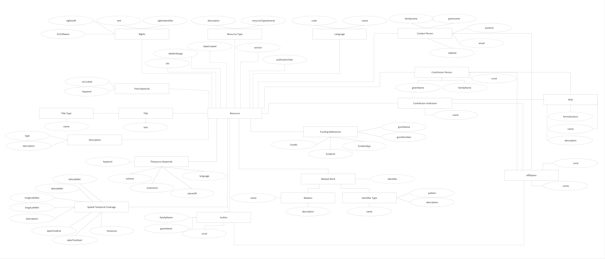

# ELMO - Enhanced Laboratory Metadata Organizer

The Enhanced Laboratory Metadata Organizer (ELMO) is based on a student cooperation project between the [University of Applied Sciences Potsdam](https://fh-potsdam.de) and the [GeoForschungsZentrum Potsdam](https://gfz.de). The editor saves metadata for research datasets in valid XML files according to the DataCite, ISO and DIF schema.

## Main Features
- Simple mapping of entered data using XSLT.
- Modular, customizable front end.
- Multilingualism through the use of language files.
- Always up-to-date controlled vocabularies through regular automatic updates.
- Easy input of authors and contributors using ORCID preload.
- Submitting of metadata directly to data curators.
- Authors can be sorted by drag & drop

## Installation

### Requirements

The installation of ELMO is possible on operating systems such as recent Windows versions (e.g. Windows 10/11) and the most common Linux distributions (e.g. Ubuntu, Debian).
Following conditions are required for installation:
- PHP ≥ 8.2 and ≤ 8.4
	- incl. a webserver able to perform PHP operations (such as Apache or Nginx)
	- extensions needed: XSL, ZIP
- MySQL (for further requirements, see: [MySQL Documentation](https://dev.mysql.com/doc/refman/8.0/en/installing-and-configuration.html)) or MariaDB

### Quick installation guide

1. Ensure a development environment with PHP >8.2 and a MySQL or MariaDB server.
2. The XSL and ZIP extensions for PHP must be installed and enabled.
3. Don't forget to start Apache and MySQL.
4. Create a new empty sql database in (e.g. using phpMyAdmin) and copy the name of the database.
5. Copy the content of the file `sample_settings.php` into a new file `settings.php` and adjust the settings for the database connection.
6. For the automatically generated time zone selection, create a free API key at [timezonedb.com](https://timezonedb.com/) and enter it into the newly created `settings.php`.
7. Create a Google Maps JS API key and paste it into the `settings.php` file as well.
8. Copy all files from this repository into the `htdocs` or `www` folder of your web server.
9. Access `install.php` via the browser. The database tables will be created automatically in your database.
10. The metadata editor is now accessible in the browser via `localhost/directoryname`.
11. Adjust settings in `settings.php` (see [Settings Section](#einstellungen)).

If you encounter problems with the installation, feel free to leave an entry in the feedback form or in [our issue board on GitHub](https://github.com/McNamara84/gfz-metadata-editor-msl-v2/issues)!

 
  
 

  ### Detailed example installation on Windows 10/11
  

  This section will further explain the installation of the metadata editor with the help of a more detailed step-by-step guide on how to install the metadata editor on Windows 10/11 using PHP and MySQL. For a local development environment, localhost-based access to the server is usually sufficient.
  #### 1. Setting up the development environment
  - Download and run the installer from the official [PHP website](https://www.php.net/downloads.php) (PHP > 8.2).
  - Install [MySQL](https://dev.mysql.com/downloads/installer/) or MariaDB.
  - Install and enable the XSL and ZIP extensions for PHP. In order to do that, open the `php.ini` file and uncomment the line for the required extensions.
  #### 2. Starting Apache and MySQL
  - If you're using an all-in-one solutions such as XAMPP or WampServer, you can start Apache directly from the XAMPP or WampServer control panel.
  - Alternatively, you can manually start Apache by navigating to the `bin` directory of Apache (e.g., `C:\xampp\apache\bin`) and running `httpd.exe`.
  #### 3. Creating an empty SQL database
  - Using phpMyAdmin: If you're using XAMPP or WampServer, phpMyAdmin is already installed. You can access it by going to `http://localhost/phpmyadmin` in your browser.
  - Create a new database and remember the name of it, as you'll need it later in the next step.
  - Alternatively, using the Windows PowerShell: 
    - Start MySQL in the Shell while being in your SQL directory: `mysql -u root -p`
    - Create a database: `CREATE DATABASE your_database;`
    - Create a new MySQL-user for the installation: `CREATE USER 'username'@'localhost' IDENTIFIED BY 'password';`
    - Granting rights to this user: `GRANT CREATE ON your_database.* TO 'username'@'localhost';` and save with `FLUSH PRIVILEGES;`
    - Optional: confirm the creation of the database while being logged in as the new user: `SHOW DATABASES;`
  #### 4. Setting up the `settings.php` file
  - Download all files from this repository into the `htdocs`or`www`folder of your webserver.
  - Create `settings.php`:
    - Copy the entire contents of `sample_settings.php` which is located in the first level of the ELMO repository and save it as `settings.php` in the same directory.
  - Adjust the database connection:
    - Open the `settings.php` file with a text editor and modify the database connection settings according to your database name, user, password and host. The default MySQL user ist 'root'. Change this to the MySQL-user you just created in step 3. The host value typically remains as 'localhost'.
  #### 5. Setting up the application
  - Access the installation script in your browser as follows: `http://localhost/your_directory/install.php`. This script will automatically create the required tables in the database you specified in step 3. In addition, three test datasets are installed through `install.php`.
  #### 6. (Optional) Creating an API key for the automatically generated time zone selection
  - Sign up for a free API key at [timezonedb.com](https://timezonedb.com/). After registration, you should receive an email with your account data including your API key.
  - Insert your API key in `settings.php`in the according line.
  #### 7. Creating a Google Maps JS API key
  - Get a Google Maps JS API key via the [Google Cloud Console](https://console.cloud.google.com). To do this, create a project, enable the Google Maps JavaScript API and get your API key.
  - Insert your Google Maps API key in the corresponding line in the `settings.php`file. 
  #### 8. Accessing the metadata editor
  - After the installation is complete, you should be able to access the metadata editor in your browser at `http://localhost/your_directory`.
  - Settings may be modified in `settings.php`.

## Dependencies

The following third-party dependencies are included in header.html and footer.html:

- [Bootstrap 5.3.3](https://github.com/twbs/bootstrap/releases) 
  For the design, responsiveness and dark mode.
- [Bootstrap Icons 1.11.3](https://github.com/twbs/icons/releases) 
  For the icons used.
- [jQuery 3.7.1](https://github.com/jquery/jquery/releases) 
  For the event handlers in JavaScript and to simplify the JavaScript code.
- [jQuery UI 1.14.1](https://github.com/jquery/jquery-ui/releases) 
  Extends jQuery with the autocomplete function that we currently use for the affiliation fields.
- [Tagify 4.33.0](https://github.com/yairEO/tagify/releases) 
  Is used for the Thesaurus Keywords field, the entry of multiple affiliations and free keywords.
- [jsTree 3.3.17](https://github.com/vakata/jstree/releases) 
  Is used to display the thesauri as a hierarchical tree structure.
- [Swagger UI 5.18.2](https://github.com/swagger-api/swagger-ui/releases) 
  For displaying the dynamic and interactive API documentation in accordance with OpenAPI standard 3.1.

## Settings

In addition to the access data for the database, other settings can also be adjusted in the `settings.php` file:

- `$host`: Database host.
- `$username`: Username of the user with access to the given database.
- `$password`: Password of database user.
- `$database`: Name of the database created.
- `$maxTitles`: Defines the maximum number of titles that users can enter in the editor.
- `$mslLabsUrl`: URL to the JSON file with the current list of laboratories.
- `$showFeedbackLink`: true-> feedback function switched on, false-> feedback function switched off
- `$smtpHost`: URL to the SMTP mail server
- `$smtpPort`: Port of the mail server
- `$smtpUser`: User name of the mailbox for sending the mails
- `$smtpPassword`: Password of the mailbox
- `$smtpSender`: Name of the sender in the feedback mails
- `$feedbackAddress`: Email Address to which the feedback is sent
- `$xmlSubmitAddress`: Email Address to which the finished XML file is sent

## API-Dokumentation

Diese Dokumentation beschreibt die verfügbaren API-Endpunkte für die GFZ Data Services Webanwendung. Sie richtet sich an Administratoren und Techniker, die diese Anwendung auf einem eigenen Webserver installieren und verwalten möchten.

### Allgemeine Informationen

- Basis-URL: `https://mde2.cats4future.de/api.php`
- Alle Anfragen sollten via HTTPS erfolgen
- Antworten werden im JSON-Format zurückgegeben, sofern nicht anders angegeben

### API-Endpunkte

[Interaktive Dokumentation](https://mde2.cats4future.de/api/v2/docs/index.html) der neuen APIv2-Endpunkte.

  
 
  
 ### 1. GCMD Science Keywords (deprecated, use [APIv2](https://mde2.cats4future.de/api/v2/docs/index.html))
  

  GET ?action=getGcmdScienceKeywords

  Liefert das kontrollierte Vokabular der GCMD Science Keywords.

  **Antwort:**
  JSON-Array mit Objekten, die folgende Schlüssel enthalten:

  - `id`: Eindeutige Kennung
  - `text`: Bezeichnung des Keywords
  - `language`: Sprachcode
  - `scheme`: Name des Schemas
  - `schemeURI`: URI des Schemas
  - `description`: Beschreibung
  - `children`: Array von Unterkategorien mit der gleichen Struktur

  

  ### 2. Zeitzonen aktualisieren (deprecated, use [APIv2](https://mde2.cats4future.de/api/v2/docs/index.html))
  

  GET ?action=getTimezones

  Aktualisiert die Liste der Zeitzonen für das Feld `Timezones` in der Gruppe `Spatial and temporal coverage`.

  **Empfohlener Ausführungsintervall:** Monatlich

  **Antwort:**
  Bestätigungsnachricht über erfolgreiche Aktualisierung

  

  
  ### 3. NASA Science Keywords (deprecated, use [APIv2](https://mde2.cats4future.de/api/v2/docs/index.html))

  GET ?action=getNasaScienceKeywords

  Aktualisiert den Thesaurus für die NASA Science Keywords.

  **Empfohlener Ausführungsintervall:** Wöchentlich

  **Antwort:**
Bestätigungsnachricht über erfolgreiche Aktualisierung

### 4. ROR Affiliations (deprecated, neue Version in [APIv2](https://mde2.cats4future.de/api/v2/docs/index.html))

GET ?action=getRorAffiliations

Aktualisiert die Daten für die Auswahlfelder der Affiliations von Personen.

**Empfohlener Ausführungsintervall:** Wöchentlich

**Antwort:**
Bestätigungsnachricht über erfolgreiche Aktualisierung

  

### 5. CrossRef Funders (deprecated, neue Version in [APIv2](https://mde2.cats4future.de/api/v2/docs/index.html))

GET ?action=getCrossRefFunders

Aktualisiert die Auswahloptionen im Funders-Dropdown-Feld.

**Empfohlener Ausführungsintervall:** Wöchentlich

**Antwort:**
Bestätigungsnachricht über erfolgreiche Aktualisierung

  
  
  
 ### 6. Resource as DataCite XML (deprecated, use [APIv2](https://mde2.cats4future.de/api/v2/docs/index.html))

  
  GET ?action=getResourceAsDataciteXml&id={resource_id}&download={true|false}

  Exportiert einen Datensatz als XML-Datei gemäß dem DataCite-Schema (Version 4.5).

  **Parameter:**

  - `id`: ID des Datensatzes (erforderlich)
  - `download`: Bei `true` wird die XML-Datei zum Download angeboten, bei `false` wird der XML-Inhalt zurückgegeben (optional, Standard: `false`)

  **Antwort:**
  XML-Datei oder XML-Inhalt

### 7. Resource as ISO XML (deprecated, use [APIv2](https://mde2.cats4future.de/api/v2/docs/index.html))

GET ?action=getResourceAsIsoXml&id={resource_id}&download={true|false}

Exportiert einen Datensatz als XML-Datei gemäß dem ISO-Standard.

**Parameter:**

- `id`: ID des Datensatzes (erforderlich)
- `download`: Bei `true` wird die XML-Datei zum Download angeboten, bei `false` wird der XML-Inhalt zurückgegeben (optional, Standard: `false`)

**Antwort:**
XML-Datei oder XML-Inhalt

  

  ### 8. Resource as DIF XML (deprecated, use [APIv2](https://mde2.cats4future.de/api/v2/docs/index.html))

  

  GET ?action=getResourceAsDifXml&id={resource_id}&download={true|false}

  Exportiert einen Datensatz als XML-Datei gemäß dem DIF-Format.

  **Parameter:**

  - `id`: ID des Datensatzes (erforderlich)
  - `download`: Bei `true` wird die XML-Datei zum Download angeboten, bei `false` wird der XML-Inhalt zurückgegeben (optional, Standard: `false`)

  **Antwort:**
  XML-Datei oder XML-Inhalt

  

  ### 9. All resources as one XML (deprecated, use [APIv2](https://mde2.cats4future.de/api/v2/docs/index.html))

  

  GET ?action=getResourcesAsOneFile&id={resource_id}

  Exportiert einen Datensatz in allen drei XML-Formaten (DataCite, ISO, DIF) in einer einzigen XML-Datei.

  **Parameter:**

  - `id`: ID des Datensatzes (erforderlich)

  **Antwort:**
  XML-Datei zum Download

  

 ### 10. MSL Vokabulare aktualisieren (deprecated, use [APIv2](https://mde2.cats4future.de/api/v2/docs/index.html))

  

  GET ?action=getMslVocab&type={vocab_type}

  Aktualisiert die kontrollierten Vokabulare des Materials Science Laboratory (MSL).

  **Parameter:**

  - `type`: Typ des Vokabulars (erforderlich)
    - Mögliche Werte: `all`, `analogue`, `geochemistry`, `geologicalage`, `geologicalsetting`, `materials`, `microscopy`, `paleomagnetism`, `porefluids`, `rockphysics`

  **Antwort:**
  JSON-Objekt mit Aktualisierungsstatus für jedes Vokabular

  

 ### 11. MSL Labs aktualisieren (deprecated, use [APIv2](https://mde2.cats4future.de/api/v2/docs/index.html))

  

  GET ?action=getMslLabs

  Aktualisiert die Liste der MSL Labs.

  **Antwort:**
  Bestätigungsnachricht über erfolgreiche Aktualisierung

### 12. CGI Keywords aktualisieren

GET ?action=getCGIKeywords

Aktualisiert die CGI Simple Lithology Keywords.

**Antwort:**
Bestätigungsnachricht über erfolgreiche Aktualisierung

### 13. Chronostrat Keywords aktualisieren

GET ?action=getChronostratKeywords

Aktualisiert die Keywords aus der International Chronostratigraphic Chart.

**Antwort:**
Bestätigungsnachricht über erfolgreiche Aktualisierung

### 14. GEMET Concepts aktualisieren

GET ?action=getGemetConcepts

Aktualisiert die Konzepte des GEMET Thesaurus.

**Antwort:**
Bestätigungsnachricht über erfolgreiche Aktualisierung

  

  ### 15.  Rollen abrufen (deprecated, use [APIv2](https://mde2.cats4future.de/api/v2/docs/index.html))

  

  GET ?action=getRoles&type={role_type}

  Ruft Rollen aus der Datenbank ab.

  **Parameter:**

  - `type`: Typ der Rollen (erforderlich)
    - Mögliche Werte: `all`, `person`, `institution`, `both`

  **Antwort:**
  JSON-Array mit Rollen-Objekten

  

  ### 16.  NASA Instruments Keywords aktualisieren (deprecated, use [APIv2](https://mde2.cats4future.de/api/v2/docs/index.html))

  

  

  ### 17.  NASA Platforms Keywords aktualisieren (deprecated,  neue Version in  [APIv2](https://mde2.cats4future.de/api/v2/docs/index.html))

  

  

  ### 18. Lizenzen abrufen (deprecated, use [APIv2](https://mde2.cats4future.de/api/v2/docs/index.html))

  

  

  
  ### 19. Keywords abrufen (deprecated, neue Version in [APIv2](https://mde2.cats4future.de/api/v2/docs/index.html))

  GET ?action=getKeywords&curationType={curation_type}

  Ruft Keywords aus der Datenbank ab.

  **Parameter:**

  - `curationType`: Typ der Kuration (optional)
    - Mögliche Werte: `all`, `isCurated`

  **Antwort:**
  JSON-Array mit Keyword-Objekten

  

  
  ### 20. Relationen abrufen (deprecated, neue Version in [APIv2](https://mde2.cats4future.de/api/v2/docs/index.html))

  GET ?action=getRelations

  Ruft alle Relationen aus der Datenbank ab.

  **Antwort:**
  JSON-Array mit Relation-Objekten

  

  
  ### 21. Identifier-Typ ermitteln (deprecated, neue Version in [APIv2](https://mde2.cats4future.de/api/v2/docs/index.html))

  GET ?action=getIdentifierType&identifier={identifier_string}

  Ermittelt den Typ eines gegebenen Identifiers.

  **Parameter:**

  - `identifier`: Der zu prüfende Identifier-String (erforderlich)

  **Antwort:**
  JSON-Objekt mit dem ermittelten Identifier-Typ oder einer Fehlermeldung

  

  
  ### 22. Identifier-Pattern abrufen (deprecated, neue Version in [APIv2](https://mde2.cats4future.de/api/v2/docs/index.html))

  GET ?action=getPattern&type={identifier_type}

  Ruft das Regex-Pattern für einen bestimmten Identifier-Typ ab.

  **Parameter:**

  - `type`: Der Identifier-Typ (erforderlich)

  **Antwort:**
  JSON-Objekt mit dem Regex-Pattern oder einer Fehlermeldung

  

  
  ### 23. Alle Identifier-Typen abrufen (deprecated, neue Version in [APIv2](https://mde2.cats4future.de/api/v2/docs/index.html))

  GET ?action=getIdentifierTypes

  Ruft alle verfügbaren Identifier-Typen aus der Datenbank ab.

  **Antwort:**
  JSON-Array mit Identifier-Typ-Objekten

## Formularfelder

### Resource Information

- DOI

  This field contains the DOI (Digital Object Identifier) that identifies the resource.
  - Data type: String
  - Occurrence: 0-1
  - The corresponding field in the database where the value is stored is called: `doi` in the table `Resource`.
  - Restrictions: Must be in “prefix/suffix” format.
  - [DataCite documentation](https://datacite-metadata-schema.readthedocs.io/en/4.5/properties/identifier/)
  - Example values: `10.5880/GFZ.3.1.2024.002` `10.5880/pik.2024.001`
  - Mapping: is mapped to `<identifier>` in the DataCite scheme and to `<gmd:fileIdentifier>` as well as `<gmd:identifier> <gmd:MD_Identifier> <gmd:code>` and `<gmd:distributionInfo> <gmd:MD_Distribution> <gmd:transferOptions> <gmd:MD_DigitalTransferOptions> <gmd:onLine> <gmd:CI_OnlineResource>` in the ISO scheme.

- Publication Year

    This field contains the publication year of the resource.
    - Data type: Year
    - Occurrence: 1
    - The corresponding field in the database where the value is saved is called: `year` in the table `year`.
    - Restrictions: A year in four-digit format. Values allowed in four-digit format: 1901 to 2155 (due to data type YEAR)
    - [DataCite documentation](https://datacite-metadata-schema.readthedocs.io/en/4.5/properties/publicationyear/#publicationyear)
    - Example values: `1998`, `2018`
    - Mapping: is mapped to `<publicationYear>` in the DataCite scheme

- Resource Type

  This field contains the type of resource.
  - Data type: String
  - Occurrence: 1
  - The corresponding field in the database where the value is saved is called: `resource_type_general` in the table `Resource_Type`.
  - Restrictions: must be selected from [controlled list](https://datacite-metadata-schema.readthedocs.io/en/4.5/appendices/appendix-1/resourceTypeGeneral/#resourcetypegeneral) 
  - [DataCite documentation](https://datacite-metadata-schema.readthedocs.io/en/4.5/properties/resourcetype/#a-resourcetypegeneral)
  - Example values: `Dataset` `Audiovisual` `Book`
  - Mapping: mapped to `<resourceType resourceTypeGeneral="XX">` in the DataCite scheme

- Version

  This field contains the version number of the resource.
  - Data type: Float
  - Occurrence: 0-1
  - The corresponding field in the database where the value is saved is called: `version` in the table `Resource`.
  - Restrictions: - 
  - [DataCite documentation](https://datacite-metadata-schema.readthedocs.io/en/4.5/properties/version/)
  - Example values: `1.0` `2.1` `3.5`
  - Mapping: mapped to `<version>` in DataCite scheme

- Language of Dataset

  This field contains the language of the dataset
  - Data type: String
  - Occurence: 1
  - The corresponding field in the database where the value is saved is called: `name` in the table `Language`.
  - Restrictions: must be selected from controlled list
  - [DataCite-Dokumentation](https://datacite-metadata-schema.readthedocs.io/en/4.5/properties/language/)
  - Beispielwerte: `Englisch`, `German`, `French`
  - Mapping: mapped to `<language>` element in DataCite scheme and to `<gmd:language>` in ISO scheme 

- Title

  This field contains the title of the resource.
  - Data type: String
  - Occurrence: 1-n, with n=$maxTitles specified in the settings.php
  - The corresponding field in the database where the value is stored is called: `text` in the table `title`.
  - Restrictions: Must be specified.
  - [DataCite documentation](https://datacite-metadata-schema.readthedocs.io/en/4.5/properties/title/)
  - Example values: `Drone based photogrammetry data at the Geysir`
  - Mapping: mapped to `<titles> <title>` in DataCite scheme and `<identificationInfo> <MD_DataIdentification> <citation> <CI_Citation> <title>` or `...<alternateTitle` depending on the title type

- Title Type

  This field contains the type of title (other than the main title).
  - Data type: String
  - Occurrence: 1, if the corresponding title is not the main title
  - The corresponding field in the database where the value is stored is called: `name` in the table `Title_Type`.
  - Restrictions: must be sleected from controlled list
  - [DataCite documentation](https://datacite-metadata-schema.readthedocs.io/en/4.5/properties/title/#a-titletype)
  - Example values: `Translated Title`
  - Mapping: mapped to `<title titleType="TranslatedTitle">` in the datacite scheme

### Licenses & Rights

- Rights Title
The content of this field is mapped to `<rights>` in the DataCite scheme and to `<resourceConstraints> <gmd:MD_Constraints> <gmd:useLimitation>` as well as `<gmd:resourceConstraints> <gmd:MD_LegalConstraints>` in the ISO scheme.

  This field contains the title of the license with its abbreviation.
  - Data type: String
  - Occurrence: 1
  - The corresponding fields in the database where the value is stored is called: `text`and `rightsIdentifier` in the table `Rights`.
  - Restrictions: Mandatory field. Must be selected from controlled list.
  - [DataCite documentation](https://datacite-metadata-schema.readthedocs.io/en/4.5/properties/rights/)
  - Example values: `Creative Commons Attribution 4.0 International (CC-BY-4.0)`

- *Saved in backend (not visible to user):* rightsURI

  This field contains the URI of the License.
  - Data Type: String
  - Occurence: 1
  - The corresponding fields in the database where the value is stored is called: `rightsURI` in the table `Rights`.
  - Restrictions: Mandatory field. Must be selected from controlled list.
  - [DataCite documentation](https://datacite-metadata-schema.readthedocs.io/en/4.5/properties/rights/#a-rightsuri)
  - Example values: `https://creativecommons.org/licenses/by/4.0/legalcode`

- *Saved in backend (not visible to user):* forSoftware

  This field specifies if the license is used for software (forSoftware=1) or not (forSoftware=0). The controlled list changes for users based on this parameter when resource type Software is chosen.

### Authors
Author information mapped to `<creator>` element in the datacite scheme and to `<citedResponsibleParty>` in the ISO scheme.
Occurrence is: 1-n

- Last Name 

  This field contains the author's surname.
  - Data type: String
  - Occurrence: 1
  - The corresponding field in the database where the value is stored is called: `familyname` in the table `author`.
  - Restrictions: mandatory field, only letters allowed
  - [DataCite documentation](https://datacite-metadata-schema.readthedocs.io/en/4.5/properties/creator/#familyname)
  - Example values: `Jemison` `Smith`

- First Name

  This field contains the author's first name.
  - Data type: String
  - Occurrence: 1
  - The corresponding field in the database where the value is stored is called: `givenname` in the table `author`.
  - Restrictions: mandatory field, only letters allowed
  - [DataCite documentation](https://datacite-metadata-schema.readthedocs.io/en/4.5/properties/creator/#givenname)
  - Example values: `Jemison` `Smith`

- Author ORCID

  This field contains the author's ORCID (Open Researcher and Contributor ID).
  - Data type: String
  - Occurrence: 0-1
  - The corresponding field in the database where the value is stored is called: `orcid` in the table `author`.
  - Restrictions: Must be in the format “xxxx-xxxx-xxxx-xxxx-xxxx”.
  - [DataCite documentation](https://datacite-metadata-schema.readthedocs.io/en/4.5/properties/creator/#nameidentifier)
  - Example values: `0000-0001-5727-2427`, `0000-0003-4816-5915`

- Affiliation
 
  This field contains the author's affiliation.
  - Data type: String
  - Occurrence: 0-n
  - The corresponding field in the database where the value is stored is called: `name` in the table `affiliation`.
  - Restrictions: None, can be chosen from the dropdown menu or given as free text
  - [DataCite documentation](https://datacite-metadata-schema.readthedocs.io/en/4.5/properties/creator/#affiliation)
  - Example values: `Technische Universität Berlin` `Helmholtz Centre Potsdam - GFZ German Research Centre for Geosciences`

- *Saved in backend (not visible to user):* rorId

  If an affiliation is chosen from the dropdown menu, which contains the entry from the Research Organization Registry (ROR), the assiciated ROR-ID is saved.
  - Occurrence: 0-n
  - The corresponding field in the database where the value is stored is called: `rorId` in the table `affiliation`.
  - Restrictions: is automatically saved when an affiliation is chosen
  - [DataCite documentation](https://datacite-metadata-schema.readthedocs.io/en/4.5/properties/creator/#a-affiliationidentifier)
  - Example values: `03v4gjf40`, `04z8jg394`

### Contact Person(s)
A Contact Person is saved as a "Contributor" with the role "Contact Person" in the DataCite scheme (version 4.5) and as a "Point of Contact" in the ISO scheme (Version 2012-07-13)

- Last name

  - This field contains the surname of the person.
  - Data type: String
  - Occurrence: 1
  - The corresponding field in the database where the value is stored is called: familyname in the Contact_Person table
  - Restrictions: Mandatory
  - Example values: `Jemison` `Smith`

- Firstname

  - This field contains the first name of the person.
  - Data type: String
  - Occurrence: 1
  - The corresponding field in the database where the value is stored is called: givenname in the table Contact_Person
  - Restrictions: Mandatory
  - Example values: `John` `Jane`

- Position

  - This field contains the position of the person in the organisation.
  - Data type: String
  - Occurrence: 0-1
  - The corresponding field in the database where the value is saved is called: position in the Contact_Person table
  - Restrictions: Optional
  - Example values: `Working group leader` `Project leader`

- Email address

  - This field contains the email address of the person or organisation.
  - Data type: String
  - Occurrence: 1
  - The corresponding field in the database where the value is stored is called: email in the Contact_Person table
  - Restrictions: Mandatory
  - Example values: `ali.mohammed@gfz-potsdam.de` `holger.ehrmann@gfz-potsdam.de`

- Website

  - This field contains the organisation's website.
  - Data type: String
  - Occurrence: 0-1
  - The corresponding field in the database where the value is stored is called: website in the Contact_Person table
  - Restrictions: Optional.
  - Example values: `gfz-potsdam.de` `fh-potsdam.de`

- Affiliation
  - This field contains the affiliation of the person.
  - Data type: String
  - Occurrence: 0-n
  - The corresponding field in the database where the value is saved is called: name in the Affiliation table.
  - Restrictions:Optimal.
  - Example values: `Technische Universität Berlin` `GFZ, Helmholtz-Zentrum Potsdam - Deutsches GeoForschungsZentrum GFZ`
  - Note**: Use autocomplete function for the Affiliation input field! similar to the ‘Author’ form group.

### Originating Laboratory
<!-- TODO: Speicherung der Eingaben in der Datenbank dokumentieren! -->
- Labor aus dem die Daten stammen
- Vorkommen: 1-n
- Wird gespeichert als `<contributor contributorType="HostingInstitution">` im [DataCite-Schema](https://datacite-metadata-schema.readthedocs.io/en/4.5/properties/contributor/#a-contributortype)
- Name of the originating laboratory
  - Name des Labors, gewählt aus einer Liste, oder Freitext.
  - Vorkommen 1-n
  - Datentyp: Zeichenkette
  - Wird gespeichert als `<contributorName>` im [DataCite-Schema 4.5](https://datacite-metadata-schema.readthedocs.io/en/4.5/properties/contributor/) (TODO)

### Contributors

- _Personal_
- Lastname

  - In diesem Feld kommt der Nachname der/des Mitwirkenden.
  - Datentyp: Text
  - Vorkommen: 0-1
  - Das zugehörige Feld in der Datenbank, wo der Wert gespeichert wird, heißt: familyname in der Tabelle Contributor_Person
  - Restriktionen: Optional.
  - [DataCite-Dokumentation](https://datacite-metadata-schema.readthedocs.io/en/4.5/properties/contributor/#familyname)
  - Beispielwerte: `Jemison` `Smith`

- Firstname

  - In diesem Feld kommt der Vorname der/des Mitwirkenden.
  - Datentyp: Text
  - Vorkommen: 0-1
  - Das zugehörige Feld in der Datenbank, wo der Wert gespeichert wird, heißt: givenname in der Tabelle Contributor_Person
  - Restriktionen: Optional.
  - [DataCite-Dokumentation](https://datacite-metadata-schema.readthedocs.io/en/4.5/properties/contributor/#givenname)
  - Beispielwerte: `John` `Jane`

- Role

  - In diesem Feld kommt die Rolle/ Rollen der/des Mitwirkenden.
  - Datentyp: Text
  - Vorkommen: 0-10
  - Das zugehörige Feld in der Datenbank, wo der Wert gespeichert wird, heißt: Role_role_id in der Tabelle Contributor_Person_has_Role
  - Restriktionen: muss mindestens eine Rolle ausgewählt werden./muss nur eine Rolle ausgewählt werden.
  - [DataCite-Dokumentation](https://datacite-metadata-schema.readthedocs.io/en/4.5/properties/contributor/#a-contributortype)
  - Beispielwerte: `Data Manager` `Project Manager`

- ORCID

  - In diesem Feld kommt die ORCID der/des Mitwirkenden (Open Researcher and Contributor ID).
  - Datentyp: Zeichenkette
  - Vorkommen: 0-1
  - Das zugehörige Feld in der Datenbank, wo der Wert gespeichert wird, heißt: orcid in der Tabelle Contributor_Person
  - Restriktionen: Muss im Format "xxxx-xxxx-xxxx-xxxx" sein.
  - [DataCite-Dokumentation](https://datacite-metadata-schema.readthedocs.io/en/4.5/properties/contributor/#a-nameidentifierscheme)
  - Beispielwerte: `1452-9875-4521-7893` `0082-4781-1312-884x`

- Affiliation

  - In diesem Feld kommt die Zugehörigkeit der/des Mitwirkenden(Personal).
  - Datentyp: Zeichenkette
  - Vorkommen: 0-n
  - Das zugehörige Feld in der Datenbank, wo der Wert gespeichert wird, heißt: Affiliation_affiliation_id in der Tabelle Contributor_Person_has_Affiliation

  - Restriktionen: Es ist optional.
  - [DataCite-Dokumentation](https://datacite-metadata-schema.readthedocs.io/en/4.5/properties/contributor/#a-affiliationidentifier)
  - Beispielwerte: `Technische Universität Berlin` `GFZ, Helmholtz-Zentrum Potsdam - Deutsches GeoForschungsZentrum GFZ`

- _Organisational_
- Organisation Name

  - In diesem Feld kommt der Name der Institution.
  - Datentyp: Zeichenkette
  - Vorkommen: 0-1
  - Das zugehörige Feld in der Datenbank, wo der Wert gespeichert wird, heißt: **Noch nicht bekannt!**
  - Restriktionen: Es ist optional.
  - [DataCite-Dokumentation](https://datacite-metadata-schema.readthedocs.io/en/4.5/properties/contributor/#a-nametype)
  - Beispielwerte: `University of Applied Sciences Potsdam` `Helmholtz Centre Potsdam - GFZ German Research Centre for Geosciences`

- Role
  - In diesem Feld kommt die Rolle/ Rollen der Institution.
  - Datentyp: Text
  - Vorkommen: 0-10
  - Das zugehörige Feld in der Datenbank, wo der Wert gespeichert wird, heißt: **Noch nicht bekannt!**
  - Restriktionen: muss mindestens eine Rolle ausgewählt werden./muss nur eine Rolle ausgewählt werden.
  - [DataCite-Dokumentation](https://datacite-metadata-schema.readthedocs.io/en/4.5/properties/contributor/#a-contributortype)
  - Beispielwerte: `Data Collector` `Data Curator`
  
- Affiliation

  - In diesem Feld kommt die Zugehörigkeit der/des Mitwirkenden(Organisation).
  - Datentyp: Zeichenkette
  - Vorkommen: 0-n
  - Das zugehörige Feld in der Datenbank, wo der Wert gespeichert wird, heißt: Affiliation_affiliation_id in der Tabelle Contributor_Institution_has_Affiliation
  - Restriktionen: Es ist optional.
  - [DataCite-Dokumentation](https://datacite-metadata-schema.readthedocs.io/en/4.5/properties/contributor/#a-affiliationidentifier)
  - Beispielwerte: `Education and Science Workers' Union` `Institute of Science and Ethics`

### Description

- Abstract
- Ein Abstract ist definiert als eine gekürzte präzise Darstellung des Inhalts eines Datensatzes.Eine kurze Beschreibung der Ressource und des Kontextes, in dem die Ressource erstellt wurde.
- Datentyp: Freitext
- Vorkommen: 1
  **Das zugehörige Feld in der Datenbank, wo der Wert gespeichert wird, heißt: **Noch nicht bekannt!\*\*
- Restriktionen: keine - Freitext
- [DataCite-Dokumentation](https://datacite-metadata-schema.readthedocs.io/en/4.5/appendices/appendix-1/descriptionType/#abstract)
- Beispielwerte: `The dataset contains a subset of an airborne hyperspectral HyMap image over the Cabo de Gata-Nίjar Natural Park in Spain from 15.06.2005, and soil wet chemistry data based on in-situ soil sampling. The Cabo de Gata-Nίjar Natural Park is a semi-arid mediterranean area in Southern Spain, sparsely populated and with a range of landscape patterns.`

- Methods

  - Die für die Studie oder Forschung verwendete Methodik. Sie beschreibt die Art der Durchführung wie man zu einem angestrebten Ziel gelangen kann.
  - Datentyp: Freitext
  - Vorkommen: 0-1
    **Das zugehörige Feld in der Datenbank, wo der Wert gespeichert wird, heißt: **Noch nicht bekannt!\*\*
  - Restriktionen: keine - Freitext
  - [DataCite-Dokumentation](https://datacite-metadata-schema.readthedocs.io/en/4.5/appendices/appendix-1/descriptionType/#methods)
  - Beispielwerte: `Graphical representation of the steps used to reconstruct sequence alignments of the Nudix superfamily, as described in the Materials and Methods section. (A) The pipeline to build the 78-PDB structure guided sequence alignment. (B) The pipeline to build the 324-core sequence alignment guided by the 78-PDB sequence alignment. (C) The pipeline to build the alignment of the complete Nudix clan (38,950 sequences). (D) Illustration of how to combine two alignment into one guided by a scaffold alignment.`

- TechnicalInfo

  - Detaillierte Informationen zum Entwurf, der Implementierung, dem Betrieb, der Verwendung und/oder der Wartung eines Prozesses, Systems oder Instruments. Bei der Beschreibung von Software kann dies den Inhalt einer "readme.txt" und notwendige Umgebungsinformationen (Hardware, Betriebssoftware, Anwendungen/Programme mit Versionsinformationen, eine von Menschen lesbare Zusammenfassung des Softwarezwecks) umfassen, die nicht durch andere Eigenschaften (z. B. Programmiersprache) beschrieben werden können.
  - Datentyp: Freitext
  - Vorkommen: 0-1
    **Das zugehörige Feld in der Datenbank, wo der Wert gespeichert wird, heißt: **Noch nicht bekannt!\*\*
  - Restriktionen: keine - Freitext
  - [DataCite-Dokumentation](https://datacite-metadata-schema.readthedocs.io/en/4.5/appendices/appendix-1/descriptionType/#technicalinfo)
  - Beispielwerte: `Scripts written and run using Wolfram Mathematica (confirmed with versions 10.2 to 11.1). Assumes raw data matches format produced by a LTQ Orbitrap Velos mass spectrometer and exported by the proprietary software (Xcalibur) to a comma-separated values (.csv) file. The .csv files are the expected input into the Mathematica scripts. `

- Other
  - Sonstige Beschreibungsinformationen, die nicht in eine der obigen Kategorien passen.
  - Vorkommen: 0-1
    **Das zugehörige Feld in der Datenbank, wo der Wert gespeichert wird, heißt: **Noch nicht bekannt!\*\*
  - Restriktionen: keine - Freitext
  - [DataCite-Dokumentation](https://datacite-metadata-schema.readthedocs.io/en/4.5/appendices/appendix-1/descriptionType/#other)
  - Beispielwerte: `This is the description of a data set that does not fit into the categories of abstract, methods or technical information, but is nevertheless extremely necessary.`

### Keywords
Contents from the keyword fields "EPOS Multi-Scale Laboratories Keywords", "GCMD Science Keywords" and "Free Keywords" are mapped to `<subject>` in the DataCite 4.5 scheme and to `<descriptiveKeywords> <MD_Keywords> <keyword>` in the ISO scheme. 

#### EPOS Multi-Scale Laboratories Keywords

Keywords from the [EPOS Multi-Scale Laboratories vocabularies](https://epos-msl.uu.nl/vocabularies). Vocabulary can be updated from the repository via API (see [API Documentation](https://mde2.cats4future.de/api/v2/docs/index.html)).

- EPOS Multi-Scale Laboratories Keyword

  This field contains keywords to describe the content of the resource.
  - Data type: String
  - Occurrence: 0-n
  - The corresponding field in the database is called: `keyword` in the table `thesaurus_keywords`
  - Restrictions: Controlled vocabulary
  - [DataCite documentation](https://datacite-metadata-schema.readthedocs.io/en/4.5/properties/subject/)
  - Example values: `Material > minerals > chemical elements > selenium`, `Geochemistry > measured property > selenium`

- *Saved in backend (not visible to user):* scheme, schemeURI, valueURI und language

  The purpose of these fields is to clearly identify the keyword.
  - Data type: String
  - Occurence: 1 for controlled (thesaurus) keywords
  - The corresponding field in the database where the value is saved is called: `scheme`, `schemeURI`, `valueURI` and `language` in the table `thesaurus_keywords`
  - Restrictions: fields are filled automatically with data provided by the vocabulary provider and maintainer
  - [DataCite documentation](https://datacite-metadata-schema.readthedocs.io/en/4.5/properties/subject/#a-scheme)
  - Example values: 
    scheme `https://epos-msl.uu.nl/voc/materials/1.3/`, 
    schemeURI `https://epos-msl.uu.nl/voc/materials/1.3/`, 
    valueURI `https://epos-msl.uu.nl/voc/materials/1.3/minerals-chemical_elements-selenium`, 
    language `en`

#### GCMD Science Keywords

Keywords from the GCMD vocabulary. Only GCMD Science Keywords (Earth Science and Earth Science Services) are available for selection. Can be updated from [NASA's GCMD](https://www.earthdata.nasa.gov/data/tools/idn/gcmd-keyword-viewer) repository via API (see [API documentation](https://mde2.cats4future.de/api/v2/docs/index.html))

- GCMD Science Keyword

  This field contains keywords to describe the content of the resource
  - Data type: String
  - Occurrence: 0-n
  - The corresponding field in the database is called: `keyword` in the table `thesaurus_keywords`
  - Restrictions: Terms can be selected from controlled list
  - [DataCite documentation](https://datacite-metadata-schema.readthedocs.io/en/4.5/properties/subject/)
  - Example Values: `Science Keywords > EARTH SCIENCE > OCEANS > SEA ICE > SEA ICE VOLUME`,`Science Keywords > EARTH SCIENCE > TERRESTRIAL HYDROSPHERE > WATER QUALITY/WATER CHEMISTRY > CONTAMINANTS > SELENIUM`

- *Saved in backend (not visible to user):* scheme, schemeURI, valueURI, language

  The purpose of these fields is to clearly identify the keyword.
  - Data type: String
  - Occurence: 1 for controlled (thesaurus) keywords
  - The corresponding field in the database where the value is saved is called: `scheme`, `schemeURI`, `valueURI` and `language` in the table `thesaurus_keywords`
  - Restrictions: fields are filled automatically with data provided by the vocabulary provider and maintainer
  - [DataCite documentation](https://datacite-metadata-schema.readthedocs.io/en/4.5/properties/subject/#a-scheme)
  - Example values: 
    scheme `NASA/GCMD Earth Science Keywords`, 
    schemeURI `https://gcmd.earthdata.nasa.gov/kms/concepts/concept_scheme/sciencekeywords"`, 
    valueURI `https://gcmd.earthdata.nasa.gov/kms/concept/b2318fb3-788c-4f36-a1d1-36670d2da747"`, 
    language `en`

#### Free Keywords

- Free Keyword

This field contains free keywords that are not part of a thesaurus.
  - Data type: String
  - Occurrence: 0-n
  - The corresponding field in the database where the value is saved is called: `free_keyword` in the table `free_keywords`
  - Restrictions: Dublicates are not allowed
  - [DataCite documentation](https://datacite-metadata-schema.readthedocs.io/en/4.5/properties/subject/#a-scheme)
  - Example values: `Seismic tremor`, `Acoustic Emission`

### Dates
In the DataCite scheme: All field data are mapped to `<dates>`, with `dateType dateType="Available">` for the Embargo and `dateType="Created"` for the Date created.
In the ISO scheme: The data from Date created are mapped to `<date>`, while Embargo until are mapped to `<gml:endPosition>`.

- Date created
  
  - This field contains the date the resource itself was put together; this could refer to a timeframe in ancient history, a date range, or a single date for a final component, e.g., the finalized file with all the data.
  - Data type: Date
  - Occurrence: 1
  - The corresponding field in the database where the value is stored is called: `dateCreated` in the `resource` table
  - Restrictions: This field must be a valid calendar date.
  - [DataCite documentation](https://datacite-metadata-schema.readthedocs.io/en/4.5/appendices/appendix-1/dateType/#created)
  - Example values: `2024-06-05` `1999-04-07`

- Embargo until

  -This field contains the date the resource is made publicly available, marking the end of an embargo period.
  - Data typ: Date
  - Occurrence: 0-1
  - The corresponding field in the database where the value is stored is called: `dateEmbargoUntil` in the `resource` table
  - Restrictions: This field must be a valid calendar date.
  - [DataCite documentation](https://datacite-metadata-schema.readthedocs.io/en/4.5/appendices/appendix-1/dateType/#available)
  - Example values: `2024-06-15` `2000-12-31`

### Spatial and temporal coverage

Spatial and temporal coverage specifies the geographic region and time frame that the dataset encompasses, providing essential context for its relevance and applicability.
In the DataCite scheme: The data from Latitude, Longitude and Description are mapped to `<geoLocations>`, while Start Date/Time and End Date/Time are mapped to `<date dateType="Collected">`.
In the ISO scheme: All field data are mapped to `<EX_Extent>`.

- Latitude Min
  
  - This field contains the geographic latitude of a single coordinate or the smaller geographic latitude of a rectangle.
  - Data type: Floating-point number
  - Occurrence: 1
  - The corresponding field in the database where the value is stored is called: latitudeMin in the spatial_temporal_coverage table
  - Restrictions: Only positive and negative numbers in the value range from -90 to +90
  - [DataCite documentation](https://datacite-metadata-schema.readthedocs.io/en/4.5/properties/geolocation/#southboundlatitude)
  - Example values: `52.0317983498743` `-3.234`

- Latitude Max
  
  - This field contains the larger geographic latitude of a rectangle.
  - Data type: Floating-point number
  - Occurrence: 0-1
  - The corresponding field in the database where the value is stored is called: latitudeMax in the spatial_temporal_coverage table
  - Restrictions: Only positive and negative numbers in the value range from -90 to +90
  - [DataCite documentation](https://datacite-metadata-schema.readthedocs.io/en/4.5/properties/geolocation/#northboundlatitude)
  - Example values: `49.72437624376` `-32.82438824398`
  
- Longitude Min
  
  - This field contains the geographic longitude of a single coordinate or the smaller geographic longitude of a rectangle.
  - Data type: Floating-point number
  - Occurrence: 1
  - The corresponding field in the database where the value is stored is called: longitudeMin in the spatial_temporal_coverage table
  - Restrictions: Only positive and negative numbers in the value range from -180 to +180
  - [DataCite documentation](https://datacite-metadata-schema.readthedocs.io/en/4.5/properties/geolocation/#westboundlongitude)
  - Example values: `108.0317983498743` `-3.04`
  
- Longitude Max
  
  - This field contains the larger geographic longitude of a rectangle.
  - Data type: Floating-point number
  - Occurrence: 0-1
  - The corresponding field in the database where the value is stored is called: longitudeMax in the spatial_temporal_coverage table
  - Restrictions: Only positive and negative numbers in the value range from -180 to +180
  - [DataCite documentation](https://datacite-metadata-schema.readthedocs.io/en/4.5/properties/geolocation/#eastboundlongitude)
  - Example values: `99.037543735498743` `-6.4`
  
- Description

  - This field contains a free-text explanation of the geographic and temporal context.
  - Data type: Free text
  - Occurrence: 1
  - The corresponding field in the database where the value is stored is called: description in the spatial_temporal_coverage table
  - Restrictions: none
  - [DataCite documentation](https://datacite-metadata-schema.readthedocs.io/en/4.5/properties/geolocation/#geolocationplace)
  - Example values: `Several boreholes at regular intervals distributed over the entire surface.`
  
- Start Date
  
  - This field contains the starting date of the temporal classification of the dataset.
  - Data type: DATE
  - Occurrence: 1
  - The corresponding field in the database where the value is stored is called: dateStart in the spatial_temporal_coverage table
  - Restrictions: YYYY-MM-DD
  - [DataCite documentation](https://datacite-metadata-schema.readthedocs.io/en/4.5/appendices/appendix-1/dateType/#collected)
  - Example values: `2024-01-02` `1999-08-07`
  
- Start Time
  
  - This field contains the starting time.
  - Data type: TIME  
  - Occurrence: 0-1
  - The corresponding field in the database where the value is stored is called: timeStart in the spatial_temporal_coverage table
  - Restrictions: hh:mm:ss
  - [DataCite documentation](https://datacite-metadata-schema.readthedocs.io/en/4.5/appendices/appendix-1/dateType/#collected)
  - Example values: `10:43:50` `04:00:00`
  
- End Date
  
  - This field contains the ending date of the temporal classification of the dataset.
  - Data type: DATE
  - Occurrence: 1 
  - The corresponding field in the database where the value is stored is called: dateEnd in the spatial_temporal_coverage table
  - Restrictions: YYYY-MM-DD
  - [DataCite documentation](https://datacite-metadata-schema.readthedocs.io/en/4.5/appendices/appendix-1/dateType/#collected)
  - Example values: `1998-01-02` `2001-07-08`
  
- End Time
  
  - This field contains the ending time.
  - Data type: TIME 
  - Occurrence: 0-1
  - The corresponding field in the database where the value is stored is called: timeEnd in the spatial_temporal_coverage table
  - Restrictions: hh:mm:ss
  - [DataCite documentation](https://datacite-metadata-schema.readthedocs.io/en/4.5/appendices/appendix-1/dateType/#collected)
  - Example values: `11:34:56` `09:00:00`
  
- Timezone
  
  - This field contains the timezone of the start and end times specified. All possible timezones are regularly updated via the API using the getTimezones method if a CronJob is configured on the server. Important: The API key for timezonedb.com must be specified in the settings to enable automatic updates!
  - Data type: Zeichenkette (Auswahl aus Liste)
  - Occurrence: 1
  - The corresponding field in the database where the value is stored is called: timezone in the spatial_temporal_coverage table
  - Restrictions: Only values from the list are permitted
  - ISO documentation
  - Example values: `+02:00` `-08:00`

### Related Work
This is mapped to `<relatedIdentifier>` in the DataCite scheme and to `<gmd:aggregationInfo>` in the ISO scheme (not yet implemented). The element is optional in both schemes.

- Relation

  This field contains the type of relation.
  - Data type: String
  - Occurrence: 1, if relatedIdentifier is <0
  - The corresponding field in the database where the value is saved is called: `relation_fk` in the `Related_Work` table.
  - Restrictions: A relation type must be selected, if related work is specified
  - Relations can be chosen from a controlled List: [DataCite documentation](https://datacite-metadata-schema.readthedocs.io/en/4.5/properties/relatedidentifier/#b-relationtype)
  - Example values: `IsCitedBy` `IsSupplementTo` `IsContinuedBy`

- Identifier

  - This field contains the identifier
  - Data type: String
  - Occurrence: 1, if relatedIdentifier is <0
  - The corresponding field in the database where the value is stored is called: `Identifier` in the `Related_Work` table.
  - Restrictions: Must be specified, if related work specified
  - [DataCite documentation](https://datacite-metadata-schema.readthedocs.io/en/4.5/properties/relatedidentifier/)
  - Example values: `13030/tqb3kh97gh8w`, `0706.0001`, `10.26022/IEDA/112263`

- Identifier Type

  - This field contains the type of the relatedIdentifier.
  - Data type: String
  - Occurrence: 0-1
  - The corresponding field in the database where the value is stored is called: `identifier_type_fk` in the `Related_Work` table.
  - if possible, the Identifier Type is automatically selected based on the structure of Identifier (see `function updateIdentifierType`) 
  - Restrictions: Must be selected, if related work is specified
  - must be chosen from a controlled List: [DataCite documentation](https://datacite-metadata-schema.readthedocs.io/en/4.5/properties/relatedidentifier/#a-relatedidentifiertype)
  - Example values: `ARK` `arXiv` `EAN13`

### Funding Reference
This element is optional in the DataCite scheme. However, it is a best practice to supply funding information when financial support has been received.

- Funder
  
  Name of the funding provider.
  - Data type: String
  - Occurence: 0-1, if Funding Reference is specified, then funderName is mandatory. 
  - The corresponding field in the database where the value is stored is called: `funder` in the `Funding_Reference` table.
  - Restrictions: Selection from CrossRef funders list is possible, as well as free text
  - [DataCite documentation](https://datacite-metadata-schema.readthedocs.io/en/4.5/properties/fundingreference/)
  - Example values: `Gordon and Betty Moore Foundation`, `Ford Foundation`

- *Saved in backend (not visible to user):* funderId

  Uniquely identifies a funding entity, using Crossrefs' [Funder Registry](https://www.crossref.org/services/funder-registry/)
  - Data type: String
  - Occurence: 0-1
  - The corresponding field in the database where the value is stored is called: `funderid` in the `Funding_Reference` table.
  - Restrictions: is automatically saved, if a funder is selected from the dropdown list
  - [DataCite documentation](https://datacite-metadata-schema.readthedocs.io/en/4.5/properties/fundingreference/#funderidentifier)
  - Example values: `http://dx.doi.org/10.13039/100001214`

- *Saved in backend (not visible to user):* funderidtyp

  The type of the funderIdentifier. Is either NULL or "Crossref Funder ID"
  - Data type: String
  - Occurence: 0-1
  - The corresponding field in the database where the value is stored is called: `funderidtyp` in the `Funding_Reference` table.
  - Restrictions: can only be "Crossref Funder ID" (if a funder is selected from the dropdown list) or null
  - [DataCite documentation](https://datacite-metadata-schema.readthedocs.io/en/4.5/properties/fundingreference/#a-funderidentifiertype)
  - Value: `Crossref Funder ID`

- Grant Number

  The code assigned by the funder to a sponsored award (grant).
  - Data type: String
  - Occurence: 0-1
  - The corresponding field in the database where the value is stored is called: `grantnumber` in the `Funding_Reference` table.
  - Restrictions: None
  - [DataCite documentation](https://datacite-metadata-schema.readthedocs.io/en/4.5/properties/fundingreference/#awardnumber)
  - Example values: `GBMF3859.01` `GBMF3859.22`

- Grant Name

  The human readable title or name of the award (grant).
  - Data type: String
  - Occurence: 0-1
  - The corresponding field in the database where the value is stored is called: `grantname` in the `Funding_Reference` table.
  - Restrictions: None
  - [DataCite documentation](https://datacite-metadata-schema.readthedocs.io/en/4.5/properties/fundingreference/#awardtitle)
  - Example values: `Socioenvironmental Monitoring of the Amazon Basin and Xingu`, `Grantmaking at a glance`

## Data validation

- Mandatory fields: **Publication Year**, **Resource Type**, **Title**, **Title Type**(_not for the first (main) title!_), **Author Lastname**, **Author Firstname**,**Contact Person Lastname**, **Contact Person Firstname**, **Contact Person Email**, **Description Abstract**, **Date created**, **Min Latitude**, **Min Longitude**, **STC Description**, **STC Date Start**, **STC Date End** und **STC Timezone**.❗

- Other fields **DOI**, **Version**, **Language of Dataset**, **Rights**, **Author ORCID**, **Author Affiliation**, **Contact Person Position**, **Contact Person Website**, **Contact Person Affiliation**, **Contributor ORCID**, **Contributor Role**, **Contributor Lastname**, **Contributor Firstname**, **Contributor Affiliation**, **Contributor Organisation Name**, **Contributor Organisation Role**, **Contributor Organisation Affiliation**, **Description Methods**, **Description TechnicalInfo**, **Description Other**, **Thesaurus Keywords**, **MSL Keywords**, **Free Keywords**, **STC Max Latitude**, **STC Max Longitude**, **STC Time Start**, **STC Time End**, **Related work all fields** and **Funding Reference all fields** are optional.✅

- The following field become mandatory in certain cases:

**Contributor Role**, **Contributor Lastname**, **Contributor Firstname** become mandatory, if one of the Contributor Person fields is filled
**Contributor Organisation Name**, **Contributor Organisation Role** become mandatory, if one of the Contributor Organisation fields is filled (this includes **Contributor Organisation Affiliation**)
**Related work all Fields** become mandatory fields, if one of the fields is filled
**Funder** becomes mandatory, if **Grant Number** or **Grant Name** are specified

## Database structure

#### ER diagram

The following ER diagram shows the relationships and structures of the tables in the database.

## Contributing

We appreciate every contribution to this project! You can use the feedback back form on the test server [link], create an issue on github or contribute directly: If you have an idea, improvement, or bug fix, please create a new branch and open a pull request (PR). We have prepared a pull request template (only available in german right now!), so we kindly ask you to use it when submitting your changes. This helps ensure we have all the necessary information to review and merge your contribution smoothly.

## Testing
The flollowing unit tests are available:
- `vendor/bin/phpunit tests/ApiTest.php`
- `vendor/bin/phpunit tests/SaveAuthorsTest.php`
- `vendor/bin/phpunit tests/SaveContactpersonsTest.php`
- `vendor/bin/phpunit tests/SaveContributorsTest.php`
- `vendor/bin/phpunit tests/SaveDescriptionsTest.php`
- `vendor/bin/phpunit tests/SaveFreekeywordsTest.php`
- `vendor/bin/phpunit tests/SaveFundingreferencesTest.php`
- `vendor/bin/phpunit tests/SaveOriginatingLaboratoryTest.php`
- `vendor/bin/phpunit tests/SaveRelatedworkTest.php`
- `vendor/bin/phpunit tests/SaveResourceInformationAndRightsTest.php`
- `vendor/bin/phpunit tests/SaveSpatialTemporalCoverageTest.php`
- `vendor/bin/phpunit tests/SaveThesauruskeywordsTest.php`
The user interface is also tested with Selenium. All tests are executed automatically during a pull.