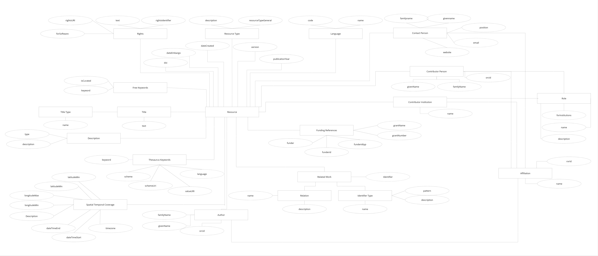

[](https://codecov.io/gh/McNamara84/elmo)
[](https://codecov.io/gh/McNamara84/elmo)
[](https://github.com/McNamara84/elmo/actions/workflows/playwright.yml)

# ELMO - Enhanced Linked Metadata Organizer

The Enhanced Linked Metadata Organizer (ELMO) is based on a student cooperation project between the [University of Applied Sciences Potsdam](https://fh-potsdam.de) and the [GFZ Helmholtz Centre for Geosciences](https://gfz.de). The editor saves metadata for research datasets in valid XML files according to the DataCite and ISO schema and supports standardized DataCite JSON-LD for local save and reload workflows.

# Citation

Ehrmann, H., Mohammed, A., Franz, J., Torkhov, A., Antipanova, T., Brauser, A., Elger, K: (2026) ELMO – Enhanced Linked Metadata Organizer. GFZ Data Services, https://doi.org/10.5880/GFZ.LIS.2026.001

## Table of contents
  - [Main Features](#main-features)
  - [Installation](#installation)
    - [Requirements](#requirements)
    - [Quick installation guide](#quick-installation-guide)
  - [Settings](#settings)
  - [Dependencies](#dependencies)
  - [API documentation](#api-documentation)
  - [Form fields](#Form-fields)
  - [Data Mapping and Occurences](#data-mapping-and-occurences)
  - [Architecture and Data Flow](#architecture-and-data-flow)
  - [Data validation](#data-validation)
  - [Database structure](#database-structure)
  - [Contributing](#contributing)
  - [Testing](#testing)
    - [PHPUnit (PHP Backend Tests)](#phpunit-php-backend-tests)
    - [Jest (JavaScript Unit Tests)](#jest-javascript-unit-tests)
    - [Playwright (End-to-End Tests)](#playwright-end-to-end-tests)

## Main Features
- Simple mapping of entered data using XSLT.
- Modular, customizable front end.
- Multilingualism through the use of language files. Add your own language file and ELMO will detect it automatically.
- Always up-to-date controlled vocabularies through regular automatic updates.
- Easy input of authors and contributors using ORCID preload.
- Fast affiliation search via server-side API (avoiding large client-side data transfers).
- Optimized page loading with GZIP compression and browser caching for static assets.
- Lazy loading of thesaurus data (JSON files loaded only when modals are opened).
- Configurable feature toggles via `ELMO_FEATURES` JavaScript object for conditional resource loading.
- Submitting of metadata directly to data curators.
- Local save and reload of standardized metadata as XML or JSON-LD.
- Authors can be sorted by drag & drop and marked as contact person with a toggle switch button.
- Submission of data descriptions files and link to data is possible.
- Optional input fields with form groups that can be hidden.
- Autosave functionality

## Installation

### Requirements

The installation of ELMO is possible on operating systems such as recent Windows versions (e.g. Windows 10/11) and the most common Linux distributions (e.g. Ubuntu, Debian).
Following conditions are required for installation:
- PHP ≥ 8.3 and ≤ 8.5
	- incl. a webserver able to perform PHP operations (such as Apache or Nginx)
	- extensions needed: XSL, ZIP
- MySQL (for further requirements, see: [MySQL Documentation](https://dev.mysql.com/doc/refman/8.0/en/installing-and-configuration.html)) or MariaDB

### Quick installation guide

1. Ensure a development environment with PHP ≥8.3 (recommended: 8.5) and a MySQL or MariaDB server.
2. The XSL and ZIP extensions for PHP must be installed and enabled.
3. Don't forget to start Apache and MySQL.
4. Create a new empty sql database in (e.g. using phpMyAdmin) and copy the name of the database.
5. Copy the content of the file `sample_settings.php` into a new file `settings.php` and adjust the settings for the database connection.
6. For the automatically generated time zone selection, create a free API key at [timezonedb.com](https://timezonedb.com/) and enter it into the newly created `settings.php`.
7. Create a Google Maps JS API key and paste it into the `settings.php` file as well.
8. Copy all files from this repository into the `htdocs` or `www` folder of your web server.
9. In this folder run `npm install` via bash.
10. There you run `composer install`. 
11. Run `php scripts/install.php basic` to create the database structure and lookup data. Use `complete` instead of `basic` only when exemplar test data is required. The installer is intentionally not available through the browser.
12. The metadata editor is now accessible in the browser via `localhost/directoryname`.
13. Adjust settings in `settings.php` (see [Settings Section](#einstellungen)).

### Installation via Docker
1. Install [Docker](https://docs.docker.com/engine/install/).
2. Clone the repository.
3. Run `docker compose build` in the cloned project folder via bash.
4. Run `docker compose up -d` to start the container.
5. This directory contains .env_sample that you will need to rename to .env. Please feel free to change the credentials in it.
	Please mind that: 
	- Environment variables for database setup only apply on first container startup. If volumes persist, old configs stay alive.
	- Use `docker compose down -v` to reset the disposable local database when updating credentials.
  - The entrypoint invokes `php scripts/install.php` with the `INSTALL_ACTION` value when the `web` container starts. Supported values are `basic` (default) and `complete` (including exemplar test data). Both modes recreate the configured schema, so use them only with the intended database.
  - If you change the database schema in `scripts/install.php` while reusing an existing local database, run the installer inside the running container:
    ```bash
    docker compose exec web php scripts/install.php basic
    ```
    For a disposable local reset, run `docker compose down -v` and then `docker compose up -d --build`; the entrypoint will run the installer again.

6. Docker Environment Setup 🐳

This section outlines the automatic processes handled by the Docker environment for ELMO. While not strictly necessary for basic usage, understanding these steps is crucial for modifying behavior or troubleshooting.

**1. `docker-compose.yaml`**
- Configures and orchestrates two primary services:
  - `db`: Built from a MariaDB image.
  - `web`: Built from the `Dockerfile`.

**2. `Dockerfile`** 
- **Base Image:** Installs `php 8.5-apache` and essential dependencies, including the database client.
- **Project Copy:** Copies the entire project directory into the container's root (`/var/www/html`), setting appropriate ownership for the standard Apache user (`www-data`). If you don't want something to be copied into container, include it into .dockerignore (performance might be affected)
- **Multi-stage build:** The PHP web container -- built from `Dockerfile.db` -- uses a multi-stage build technique. The final `prod` image does not need everything created during the build process, so it only receives the required artifacts and runs as a non-root user. Setup is:

  ```mermaid
  flowchart LR
      base[base<br/>installs PHP deps and configures server]
      dev[dev<br/>installs Node.js + Composer deps<br/>and copies project code]
      builder[builder<br/>prepares production dependencies]
      prod[prod<br/>non-root runtime image]

      base --> dev
      dev --> builder
      base --> prod
      builder -->|COPY --from=builder| prod
  ```

  Where:
  - `base` installs the PHP dependencies and configures the server.
  - `dev` installs Node.js, Composer, and project dependencies; copies the code into the container; and runs the entrypoint script. This target is meant for full control in local development.
  - `builder` minimizes the Composer installation for production artifacts.
  - `prod` gets the pre-compiled dependencies, switches to a non-root user, and runs the entrypoint script. This is more fit for mission-critical tasks.


- **Entrypoint:** Executes the `docker-entrypoint.sh` script.

**3. `docker-entrypoint.sh`** 
- **Database Setup:** Initializes the configured database by running the CLI-only `scripts/install.php`.
- **Installation Options for `scripts/install.php`:**
  - `basic` (default): Creates only the database structure and inserts lookup data.
  - `complete`: Creates the database structure, inserts lookup data, *and* populates the database with exemplar (test) data. This is controlled by the `INSTALL_ACTION` environment variable (e.g., `INSTALL_ACTION=complete`).

---

**Important Notes for Developers:**

* **Full Reset for Dockerfile/Entrypoint Changes:**
    To apply changes made to `Dockerfile` or `docker-entrypoint.sh`, a full reset of the Docker containers is required:
    ```bash
    docker compose down -v
    docker compose build --no-cache
    ```
* **Applying Other Changes:**
    For changes to project files (which are copied, not mounted as volumes), you need to rebuild the service:
    ```bash
    docker compose up --build
    ```
    This rebuilds the `web` service (and any other services specified in `docker-compose.yml` that depend on the build context), ensuring your updated project files are included in the new container image.


If you encounter problems with the installation, feel free to leave an entry in the feedback form or in [our issue board on GitHub](https://github.com/McNamara84/elmo/issues)!


<details>
  <summary>

  ## Settings
  </summary>

  In addition to the access data for the database, other settings can also be adjusted in the `settings.php` file:

  - `$host`: Database host.
  - `$username`: Username of the user with access to the given database.
  - `$password`: Password of database user.
  - `$database`: Name of the database created.
  - `$maxTitles`: Defines the maximum number of titles that users can enter in the editor.
  - `$apiKeyElmo`: A self-defined security key to connect cron jobs with api calls to `/update/` for refreshing the vocabularies.
  - `$mslLabsUrl`: URL to the JSON file with the current list of laboratories.
  - `$showFeedbackLink`: true-> feedback function switched on, false-> feedback function switched off
  - `$smtpHost`: URL to the SMTP mail server
  - `$smtpPort`: Port of the mail server
  - `$smtpUser`: User name of the mailbox for sending the mails
  - `$smtpPassword`: Password of the mailbox
  - `$smtpSender`: Name of the sender in the feedback mails
  - `$feedbackAddress`: Email Address to which the feedback is sent
  - `$xmlSubmitAddress`: Email Address to which the finished XML file is sent. When deploying the three frontend variants via `docker-compose.prod.yml`, configure this via the environment variables `XML_SUBMIT_ADDRESS`, `XML_SUBMIT_ADDRESS_MSL`, and `XML_SUBMIT_ADDRESS_GEM` for the standard, MSL, and GEM variants respectively. For ELMO GEM this is also the GFZ Data Services recipient when the DOI field is empty.
  - `$icgemSubmitAddress`: Email address that receives the ICGEM metadata file of every ELMO GEM submission, configured via the environment variable `ICGEM_SUBMIT_ADDRESS` (default `icgem@gfz.de`).
  - `DATACITE_JSONLD_CONTEXT_URL`: Optional environment variable for overriding the `@context` URL used in JSON-LD exports. If unset, ELMO falls back to the DataCite stage linked-data context.
  - `$showContributorPersons`: Specifies whether the form group Contributor Persons should be displayed (true/false).
  - `$showContributorInstitutions`: Specifies whether the form group Contributor Institutions should be displayed (true/false).
  - `$showMslLabs`: Specifies whether the form group Originating Laboratory should be displayed (true/false).
  - `$showMslVocabs`: Specifies whether the form group EPOS Multi-Scale Laboratories Keywords should be displayed (true/false).
  - `$showThesauri`: Specifies whether the form group Thesauri Keywords should be displayed (true/false). Individual thesauri are controlled by ERNIE.
  - `$showFreeKeywords`: Specifies whether the form group Free Keywords should be displayed (true/false).
  - `$showSpatialTemporalCoverage`: Specifies whether the form group Spatial and Temporal Coverages should be displayed (true/false).
  - `$showRelatedWork`: Specifies whether the form group Related Work should be displayed (true/false).
  - `$showFundingReference`: Specifies whether the form group Funding Reference should be displayed (true/false).
  - `$funderPidMode`: Controls the funder identifier type used in the Funding Reference form group. Set via the `FUNDER_PID` environment variable. Allowed values: `CFID` (Crossref Funder ID, default) or `ROR` (ROR ID via ERNIE affiliations API).
  - `$showUsedInstruments`: Specifies whether the form group Used Instruments (PID4INST via ERNIE API) should be displayed (true/false).
  - `$showGGMsProperties`: specific for implementation for the ICGEM platform. Specifies whether ICGEM form groups (GGMs Properties and Characteristics of the model) should be displayed (true/false).

  ### ERNIE Integration (Bidirectional Communication)
  
  ELMO and ERNIE communicate in both directions using separate API keys:

  ```
  ELMO → ERNIE (fetch vocabularies)
  ├─ ELMO GETs: GET https://ernie.../api/v1/resource-types/elmo
  ├─ ELMO GETs: GET https://ernie.../api/v1/title-types/elmo
  ├─ ELMO GETs: GET https://ernie.../api/v1/relation-types/elmo
  ├─ ELMO GETs: GET https://ernie.../api/v1/identifier-types/elmo
  ├─ Header: X-API-KEY: [ERNIE_API_KEY from ELMO's .env]
  └─ ERNIE verifies the key on its side

  ELMO ← ERNIE (on-demand cache refresh)
  ├─ ERNIE POSTs: POST /api/v2/admin/cache/resourcetypes/refresh
  ├─ ERNIE POSTs: POST /api/v2/admin/cache/titletypes/refresh
  ├─ ERNIE POSTs: POST /api/v2/admin/cache/relationtypes/refresh
  ├─ ERNIE POSTs: POST /api/v2/admin/cache/identifiertypes/refresh
  ├─ Header: X-API-KEY: [ELMO_API_KEY from ERNIE's config]
  └─ ELMO verifies against $apiKeyElmo in ELMO's .env
  ```

  - `$apiKeyElmo`: API key that external services (including ERNIE) use to authenticate with ELMO's admin endpoints. **Direction: ERNIE → ELMO**
  - `$ernieUrl`: URL to the ERNIE API (e.g., `https://ernie.rz-vm499.gfz.de/`). When set, resource types, title types, relation types, identifier types, and other vocabularies are fetched from ERNIE instead of the local database.
  - `$ernieApiKey`: API key for ELMO to authenticate with the ERNIE service. **Direction: ELMO → ERNIE**
  - `$ernieCacheTtl`: Cache time-to-live in seconds for all ERNIE data (resource types, title types; default: 21600 = 6 hours). Also determines the automatic refresh interval.

</details>

<details>
  <summary>

  ## Dependencies
  </summary>
Dependencies can be installed using the following terminal commands:
	1. `composer install`
	2. `npm install`
Prequisite for that is composer. If you don't have it consider brew install composer or other options

The following third-party dependencies are included in header.php and footer.html:

- [Bootstrap 5](https://github.com/twbs/bootstrap/releases)<br>
  For the design, responsiveness and dark mode.
- [Bootstrap Icons 1](https://github.com/twbs/icons/releases)<br>
  For the icons used.
- [jQuery 4](https://github.com/jquery/jquery/releases)<br>
  For the event handlers in JavaScript and to simplify the JavaScript code.
- [jQuery UI 1](https://github.com/jquery/jquery-ui/releases)<br>
  Extends jQuery with the autocomplete function that we currently use for the affiliation fields.
- [Tagify 4](https://github.com/yairEO/tagify/releases)<br>
  Is used for the Thesaurus Keywords field, the entry of multiple affiliations and free keywords.
- [jsTree 3](https://github.com/vakata/jstree/releases)<br>
  Is used to display the thesauri as a hierarchical tree structure.
- [Swagger UI 5](https://github.com/swagger-api/swagger-ui/releases)<br>
  For displaying the dynamic and interactive API documentation in accordance with OpenAPI standard 3.1.
- [Node.js](https://nodejs.org/)<br>
  Runtime environment for running JavaScript tooling and scripts. Used for npm package management, running Jest and Playwright tests, and build automation. The version is specified in the .nvmrc file. 

 ### Managing Javascript dependencies
 ELMO uses npm package manager. Files 'package.json' lists your project's dependencies and their allowed version ranges. It's the human-readable configuration. 'package-lock.json' lists all dependencies, even transitive ones (dependencies of dependencies). 'package.json' defines acceptable ranges of versions, while 'package-lock.json' locks the prescise package versions for reproducability. 
 Here are the workflows that npm enables:

#### Detecting vulnerabilities:
npm audit 
npm audit fix 

#### Installing the newest versions:
npm outdated 
npm install

</details>


## [API documentation](https://env.rz-vm182.gfz.de/elmo/api/v2/docs/)


<details>
  <summary>

  ## Form fields
  </summary>

### Resource Information

- DOI <a href="https://www.doi.org/" target="_blank" rel="noopener"></a>

  This field contains the DOI (Digital Object Identifier) that identifies the resource.
  - Data type: String
  - Occurrence: 0-1
  - The corresponding field in the database where the value is stored is called: `doi` in the table `Resource`
  - Restrictions: Must be in “prefix/suffix” format
  - [DataCite documentation](https://datacite-metadata-schema.readthedocs.io/en/4.7/properties/identifier/)
  - Example values: `10.5880/GFZ.3.1.2024.002`, `10.5880/pik.2024.001`
  - Mapping: is mapped to `<identifier>` in the DataCite scheme and to `<gmd:fileIdentifier>` as well as `<gmd:identifier> <gmd:MD_Identifier> <gmd:code>` and `<gmd:distributionInfo> <gmd:MD_Distribution> <gmd:transferOptions> <gmd:MD_DigitalTransferOptions> <gmd:onLine> <gmd:CI_OnlineResource>` in the ISO scheme

- Publication Year

    This field contains the publication year of the resource.
    - Data type: Year
    - Occurrence: 1
    - The corresponding field in the database where the value is saved is called: `year` in the table `year`
    - Restrictions: A year in four-digit format. Values allowed in four-digit format: 1901 to 2155 (due to data type YEAR)
    - [DataCite documentation](https://datacite-metadata-schema.readthedocs.io/en/4.7/properties/publicationyear/#publicationyear)
    - Example values: `1998`, `2018`
    - Mapping: is mapped to `<publicationYear>` in the DataCite scheme


- Resource Type

  This field contains the type of resource.
  - Data type: String
  - Occurrence: 1
  - The corresponding field in the database where the value is saved is called: `resource_type_general` in the table `Resource_Type`
  - Restrictions: must be selected from [controlled list](https://datacite-metadata-schema.readthedocs.io/en/4.7/appendices/appendix-1/resourceTypeGeneral/#resourcetypegeneral) 
  - [DataCite documentation](https://datacite-metadata-schema.readthedocs.io/en/4.7/properties/resourcetype/#a-resourcetypegeneral)
  - Example values: `Dataset`, `Audiovisual`, `Software`
  - Mapping: mapped to `<resourceType resourceTypeGeneral="XX">` in the DataCite scheme

- Version

  This field contains the version number of the resource.
  - Data type: Float
  - Occurrence: 0-1
  - The corresponding field in the database where the value is saved is called: `version` in the table `Resource`
  - Restrictions: None 
  - [DataCite documentation](https://datacite-metadata-schema.readthedocs.io/en/4.7/properties/version/)
  - Example values: `1.0` `2.1` `3.5`
  - Mapping: mapped to `<version>` in DataCite scheme

- Language of Dataset

  This field contains the language of the dataset
  - Data type: String
  - Occurence: 1
  - The corresponding field in the database where the value is saved is called: `name` in the table `Language`
  - Restrictions: must be selected from controlled list
  - [DataCite documentation](https://datacite-metadata-schema.readthedocs.io/en/4.7/properties/language/)
  - Beispielwerte: `Englisch`, `German`, `French`
  - Mapping: mapped to `<language>` element in DataCite scheme and to `<gmd:language>` in ISO scheme 

- Title

  This field contains the title of the resource.
  - Data type: String
  - Occurrence: 1-n, with n=$maxTitles specified in the settings.php
  - The corresponding field in the database where the value is stored is called: `text` in the table `title`
  - Restrictions: None
  - [DataCite documentation](https://datacite-metadata-schema.readthedocs.io/en/4.7/properties/title/)
  - Example values: `Drone based photogrammetry data at the Geysir`
  - Mapping: mapped to `<titles> <title>` in DataCite scheme and `<identificationInfo> <MD_DataIdentification> <citation> <CI_Citation> <title>` or `...<alternateTitle` depending on the title type

- Title Type

  This field contains the type of title (other than the main title).
  - Data type: String
  - Occurrence: 1, if the corresponding title is not the main title
  - The corresponding field in the database where the value is stored is called: `name` in the table `Title_Type`
  - Restrictions: must be selected from controlled list
  - [DataCite documentation](https://datacite-metadata-schema.readthedocs.io/en/4.7/properties/title/#a-titletype)
  - Example values: `Translated Title`
  - Mapping: mapped to `<title titleType="TranslatedTitle">` in the datacite scheme

### Licenses & Rights

- Rights Title

  The content of this field is mapped to `<rights>` in the DataCite scheme and to `<resourceConstraints> <gmd:MD_Constraints> <gmd:useLimitation>` as well as `<gmd:resourceConstraints> <gmd:MD_LegalConstraints>` in the ISO scheme.

  This field contains the title of the license with its abbreviation.
  - Data type: String
  - Occurrence: 1
  - The corresponding fields in the database where the value is stored is called: `text`and `rightsIdentifier` in the table `Rights`
  - Restrictions: Mandatory field. Must be selected from controlled list
  - [DataCite documentation](https://datacite-metadata-schema.readthedocs.io/en/4.7/properties/rights/)
  - Example value: `Creative Commons Attribution 4.0 International (CC-BY-4.0)`

- *Saved in backend (not visible to user):* rightsURI

  This field contains the URI of the License.
  - Data Type: String
  - Occurence: 1
  - The corresponding fields in the database where the value is stored is called: `rightsURI` in the table `Rights`
  - Restrictions: Mandatory field. Must be selected from controlled list
  - [DataCite documentation](https://datacite-metadata-schema.readthedocs.io/en/4.7/properties/rights/#a-rightsuri)
  - Example values: `https://creativecommons.org/licenses/by/4.0/legalcode`

- *Saved in backend (not visible to user):* forSoftware

  This field specifies if the license is used for software (forSoftware=1) or not (forSoftware=0). The controlled list changes for users based on this parameter when resource type Software is chosen.

### Author(s)
#### Author Persons
Author information mapped to `<creator>` element in the datacite scheme and to `<citedResponsibleParty>` in the ISO scheme.
Occurrence is: 1-n

- Last Name 

  This field contains the author's surname.
  - Data type: String
  - Occurrence: 1
  - The corresponding field in the database where the value is stored is called: `familyname` in the table `author`
  - Restrictions: mandatory field, only letters allowed
  - [DataCite documentation](https://datacite-metadata-schema.readthedocs.io/en/4.7/properties/creator/#familyname)
  - Example values: `Jemison`, `Smith`

- First Name

  This field contains the author's first name.
  - Data type: String
  - Occurrence: 1
  - The corresponding field in the database where the value is stored is called: `givenname` in the table `author`
  - Restrictions: mandatory field, only letters allowed
  - [DataCite documentation](https://datacite-metadata-schema.readthedocs.io/en/4.7/properties/creator/#givenname)
  - Example values: `Lisa`, `Elisa`

- Author ORCID <a href="https://orcid.org/" target="_blank" rel="noopener"></a>

  This field contains the author's ORCID (Open Researcher and Contributor ID).
  - Data type: String
  - Occurrence: 0-1
  - The corresponding field in the database where the value is stored is called: `orcid` in the table `author`
  - Restrictions: Must be in the format “xxxx-xxxx-xxxx-xxxx”. Validated using the ISO 7064 Mod 11-2 checksum algorithm.
  - [DataCite documentation](https://datacite-metadata-schema.readthedocs.io/en/4.7/properties/creator/#nameidentifier)
  - Example values: `0000-0001-5727-2427`, `0000-0003-4816-5915`

- Affiliation <a href="https://ror.org/" target="_blank" rel="noopener"></a>
 
  This field contains the author's affiliation.
  - Data type: String
  - Occurrence: 0-n
  - The corresponding field in the database where the value is stored is called: `name` in the table `affiliation`
  - Restrictions: None, can be chosen from the dropdown menu or given as free text
  - [DataCite documentation](https://datacite-metadata-schema.readthedocs.io/en/4.7/properties/creator/#affiliation)
  - Example values: `Technische Universität Berlin`, `Helmholtz Centre Potsdam - GFZ German Research Centre for Geosciences`

- *Saved in backend (not visible to user):* rorId

  If an affiliation is chosen from the dropdown menu, which contains the entry from the Research Organization Registry (ROR), the assiciated ROR-ID is saved.
  - Occurrence: 0-n
  - The corresponding field in the database where the value is stored is called: `rorId` in the table `affiliation`
  - Restrictions: is automatically saved when an affiliation is chosen
  - [DataCite documentation](https://datacite-metadata-schema.readthedocs.io/en/4.7/properties/creator/#a-affiliationidentifier)
  - Example values: `03v4gjf40`, `04z8jg394`


#### Author Institutions
Author Institution has the same role as Author as a person. Here, the institution is entered as the author of the data set, for example: Helmholtz Centre Potsdam - GFZ German Research Centre for Geosciences
Occurrence is: 0-n

- Institution Name

  This field contains the Name of the Institution(author).
  - Data type: String
  - Occurrence: 0-n
  - The corresponding field in the database where the value is stored is called: `institutionname` in the table `Author\_institution`
  - Restrictions: Optional field, but may become mandatory in certain cases.
  - [DataCite documentation](https://datacite-metadata-schema.readthedocs.io/en/4.7/properties/creator/#creatorname)
  - Example values: `California Digital Library`, `Helmholtz Centre Potsdam - GFZ German Research Centre for Geosciences`

- Affiliation <a href="https://ror.org/" target="\_blank" rel="noopener"></a>

  This field contains the author's affiliation.
  - Data type: String
  - Occurrence: 0-n
  - The corresponding field in the database where the value is stored is called: `name` in the table `affiliation`
  - Restrictions: None, can be chosen from the dropdown menu or given as free text
  - [DataCite documentation](https://datacite-metadata-schema.readthedocs.io/en/4.7/properties/creator/#affiliation)
  - Example values: `Technische Universität Berlin`, `Helmholtz Centre Potsdam - GFZ German Research Centre for Geosciences`


- *Saved in backend (not visible to user):* rorId

  If an affiliation is chosen from the dropdown menu, which contains the entry from the Research Organization Registry (ROR), the assiciated ROR-ID is saved.
  - Occurrence: 0-n
  - The corresponding field in the database where the value is stored is called: `rorId` in the table `affiliation`
  - Restrictions: is automatically saved when an affiliation is chosen
  - [DataCite documentation](https://datacite-metadata-schema.readthedocs.io/en/4.7/properties/creator/#a-affiliationidentifier)
  - Example values: `03v4gjf40`, `04z8jg394`


#### Contact Person(s)
A Contact Person is saved as a "Contributor" with the role "Contact Person" in the DataCite scheme and as a "Point of Contact" in the ISO scheme (Version 2012-07-13). Authors can be labelled as a contact person with the help of a toggle switch button which adds the additional fields required for contact (Email address, Website).

- Last Name

  This field contains the surname of the person.
  - Data type: String
  - Occurrence: 1
  - The corresponding field in the database where the value is stored is called: familyname in the Contact_Person table
  - Restrictions: Mandatory
  - Example values: `Jemison`, `Smith`

- First Name

  This field contains the first name of the person.
  - Data type: String
  - Occurrence: 1
  - The corresponding field in the database where the value is stored is called: givenname in the table Contact_Person
  - Restrictions: Mandatory
  - Example values: `John`, `Jane`

- Email address

  This field contains the email address of the person or organisation.
  - Data type: String
  - Occurrence: 1
  - The corresponding field in the database where the value is stored is called: email in the Contact_Person table
  - Restrictions: Mandatory
  - Example values: `ali.mohammed@gfz.de`, `holger.ehrmann@gfz.de`

- Website

  This field contains the organisation's website.
  - Data type: String
  - Occurrence: 0-1
  - The corresponding field in the database where the value is stored is called: website in the Contact_Person table
  - Restrictions: Optional
  - Example values: `gfz.de`, `fh-potsdam.de`

- Affiliation
    
  This field contains the affiliation of the person.
  - Data type: String
  - Occurrence: 0-n
  - The corresponding field in the database where the value is saved is called: name in the Affiliation table.
  - Restrictions: Optional
  - Example values: `Technische Universität Berlin`, `GFZ, Helmholtz-Zentrum Potsdam - Deutsches GeoForschungsZentrum GFZ`
  - Note: As in all affiliation fields the ROR ID is saved, when an affiliation is chosen from the list

### Originating Laboratory
The controlled list is provided and maintained by Utrecht University ([MSL Laboratories](https://github.com/UtrechtUniversity/msl_vocabularies/blob/main/vocabularies/labs/laboratories.json)) and can be updated via API call (see [API documentation](https://dataservices.gfz.de/elmo/api/v2/docs/index.html)).

- Laboratory Name
  This field contains the laboratory, where the research data came from. Its content is mapped to `<contributor contributorType="HostingInstitution"><contributorName>` in the DataCite scheme. 
  - Data Type: String
  - Occurence: 0-n
  - The corresponding field in the database is called: `laboratoryname` in the table `originating_laboratory`
  - Restrictions: Controlled list
  - [DataCite documentation](https://datacite-metadata-schema.readthedocs.io/en/4.7/properties/contributor/#a-contributortype)
  - Example values: `Fragmentation Lab (Ludwig-Maximilians-University Munich, Germany)`, `TecMOD - GRmodel (CNRS-Rennes 1 University, France)`

- *Saved in backend (not visible to user):* LabId, laboratoryAffiliation, laboratoryRorId
    The purpose of these fields is to clearly identify the originating laboratory. The contents are mapped to `<nameIdentifier nameIdentifierScheme="labid">` and `<affiliation>` in the DataCite scheme.
    - Data type: String
    - Occurence: 1
    - The corresponding field in the database where the values are saved are called: `labId` in the table `originating_laboratory` and `name` and `rorId` in the table `affiliation`
    - Restrictions: Fields are filled automatically with data provided by the vocabulary provider and maintainer
    - Example values: 
      LabID `9cd562c216daa82792972a074a222c52`, 
      laboratoryAffiliation `Ludwig-Maximilians-University Munich, Munich, Germany`
      laboratoryRorId `https://ror.org/02e2c7k09`


### Contributors

#### _Person_
Contributor fields are optional. Only when one of the fields is filled the fields "Last Name", "First Name" and "Role" become mandatory . The contents of the fields are mapped to `<contributor contributorType="ROLE">` with `<contributorName nameType="Personal">` in the DataCite scheme.

- ORCID <a href="https://orcid.org/" target="_blank" rel="noopener"></a>

  This field contains the ORCID of the contributor (Open Researcher and Contributor ID).
  - Data type: String
  - Occurrence: 0-1
  - The corresponding field in the database where the value is stored is called: `orcid` in the `Contributor_Person` table
  - Restrictions: Must be in the format “xxxx-xxxx-xxxx-xxxx”. Validated using the ISO 7064 Mod 11-2 checksum algorithm.
  - [DataCite documentation](https://datacite-metadata-schema.readthedocs.io/en/4.7/properties/contributor/#a-nameidentifierscheme)
  - Example values: `1452-9875-4521-7893`, `0082-4781-1312-884x`

- Last Name 

  This field contains the contributpr's surname.
  - Data type: String
  - Occurrence: 1, if a contributor person is specified
  - The corresponding field in the database where the value is stored is called: `familyname` in the table `Contributor_Person`
  - Restrictions: Only letters are allowed.
  - [DataCite documentation](https://datacite-metadata-schema.readthedocs.io/en/4.7/properties/contributor/#familyname)
  - Example values: `Jemison`, `Smith`

- First Name

  This field contains the contributpr's surname.
  - Data type: String
  - Occurrence: 1, if a contributor person is specified
  - The corresponding field in the database where the value is stored is called: `givenname` in the table `Contributor_Person`
  - Restrictions: Only letters are allowed
  - [DataCite documentation](https://datacite-metadata-schema.readthedocs.io/en/4.7/properties/contributor/#givenname)
  - Example values: `John`, `Jane`

- Role

  This field contains the role(s) of the contributor(s).
  - Data type: String
  - Occurrence: 1-10, if a contributor person is specified
  - The corresponding field in the database where the value is stored is called: `name` in the `Role` table
  - Restrictions: must be selcted from controlled list
  - [DataCite documentation](https://datacite-metadata-schema.readthedocs.io/en/4.7/properties/contributor/#a-contributortype)
  - Example values: `Data Manager`, `Project Manager`

- Affiliation <a href="https://ror.org/" target="_blank" rel="noopener"></a>

  This field contains the affiliation of the contributor(s).
  - Data type: String
  - Occurrence: 0-n
  - The corresponding field in the database where the value is stored is called: `name` in the table `Affiliation`
  - Restrictions: None, can be selected from list
  - [DataCite documentation](https://datacite-metadata-schema.readthedocs.io/en/4.7/properties/contributor/#affiliation)
  - Example values: `Technische Universität Berlin`, `GFZ, Helmholtz-Zentrum Potsdam - Deutsches GeoForschungsZentrum GFZ`
    - Note: As in all affiliation fields the ROR ID is saved, when an affiliation is chosen from the list

#### _Organisation_
Contributor fields are optional. Only when one of the fields is filled the fields "Organisation Name" and "Role" become mandatory. The contents of the fields are mapped to `<contributor contributorType="ROLE">` in the DataCite scheme with `<contributorName nameType="Organizational">`

- Organisation Name

  This field contains the name of the institution.
  - Data type: String
  - Occurrence: 1, if contributing organisation is specified
  - The corresponding field in the database where the value is saved is called: `name` in the table `contributor_institution`
  - Restrictions: None
  - [DataCite documentation](https://datacite-metadata-schema.readthedocs.io/en/4.7/properties/contributor/#contributorname)
  - Example values: `University of Applied Sciences Potsdam`, `Helmholtz Centre Potsdam - GFZ German Research Centre for Geosciences`

- Role

  This field contains the role/roles of the institution.
  - Data type: String
  - Occurrence: 1-10
  - The corresponding field in the database where the value is stored is called: `name` in the table `Role`
  - Restrictions: must be selected from controlled list
  - [DataCite documentation](https://datacite-metadata-schema.readthedocs.io/en/4.7/properties/contributor/#a-contributortype)
  - Example values: `Data Collector`, `Data Curator`.
  
- Affiliation <a href="https://ror.org/" target="_blank" rel="noopener"></a>

  This field contains the affiliation of the contributing institution.
  - Data type: String
  - Occurrence: 0-n
  - The corresponding field in the database where the value is stored is called: `name` in the `Affiliation` table
  - Restrictions: None, can be selected from list
  - [DataCite documentation](https://datacite-metadata-schema.readthedocs.io/en/4.7/properties/contributor/#affiliation)
  - Example values: `Education and Science Workers' Union`, `Institute of Science and Ethics`
  - Note: As in all affiliation fields the ROR ID is saved, when an affiliation is chosen from the list
 
### Descriptions
- Abstract
  This field contains the abstract of the dataset. It is mapped to `<descriptions><description descriptionType="Abstract">` in the DataCite scheme and to `<identificationInfo><MD_DataIdentification><abstract>` in the ISO scheme
  - Data type: String
  - Occurence: 1
  - The corresponding field in the database where the value is saved is called: `description` in the table `description` with `type=Abstract`
  - Restrictions: None
  - [DataCite documentation](https://datacite-metadata-schema.readthedocs.io/en/4.7/appendices/appendix-1/descriptionType/#abstract)
  - Example value: `The dataset contains a subset of an airborne hyperspectral HyMap image over the Cabo de Gata-Nίjar Natural Park in Spain from 15.06.2005, and soil wet chemistry data based on in-situ soil sampling. The Cabo de Gata-Nίjar Natural Park is a semi-arid mediterranean area in Southern Spain, sparsely populated and with a range of landscape patterns.`

- Methods
  This field contains the The methodology employed for the study or research. It is mapped to `<descriptions><description descriptionType="Methods">` in the DataCite scheme.
  - Data type: String
  - Occurence: 0-1
  - The corresponding field in the database where the value is saved is called: `description` in the table `description` with `type = Methods`
  - Restrictions: None
  - [DataCite documentation](https://datacite-metadata-schema.readthedocs.io/en/4.7/appendices/appendix-1/descriptionType/#methods)
  - Example value: `Graphical representation of the steps used to reconstruct sequence alignments of the Nudix superfamily, as described in the Materials and Methods section. (A) The pipeline to build the 78-PDB structure guided sequence alignment. (B) The pipeline to build the 324-core sequence alignment guided by the 78-PDB sequence alignment. (C) The pipeline to build the alignment of the complete Nudix clan (38,950 sequences). (D) Illustration of how to combine two alignment into one guided by a scaffold alignment.`

- TechnicalInfo
  This field contains detailed information that may be associated with design, implementation, operation, use, and/or maintenance of a process, system, or instrument. It is mapped to `<descriptions><description descriptionType="TechnicalInfo">` in the DataCite scheme.
  - Data type: String
  - Occurence: 0-1
  - The corresponding field in the database where the value is saved is called: `description` in the table `description` with `type = Technical Information`
  - Restrictions: None
  - [DataCite documentation](https://datacite-metadata-schema.readthedocs.io/en/4.7/appendices/appendix-1/descriptionType/#technicalinfo)
  - Example value: `Scripts written and run using Wolfram Mathematica (confirmed with versions 10.2 to 11.1). Assumes raw data matches format produced by a LTQ Orbitrap Velos mass spectrometer and exported by the proprietary software (Xcalibur) to a comma-separated values (.csv) file. The .csv files are the expected input into the Mathematica scripts. `

- Other
  Other description information that does not fit into an existing category. Content of the field is mapped to `<descriptions><description descriptionType="Other">` in the DataCite scheme.
  - Data type: String
  - Occurence: 0-1
  - The corresponding field in the database where the value is saved is called: `description` in the table `description` with `type = Other`
  - Restrictions: None
  - [DataCite documentation](https://datacite-metadata-schema.readthedocs.io/en/4.7/appendices/appendix-1/descriptionType/#other)
  - Example value:  `This is the description of a data set that does not fit into the categories of abstract, methods or technical information, but is nevertheless extremely necessary.`

### Keywords
Contents from the keyword fields "EPOS Multi-Scale Laboratories Keywords", "GCMD Science Keywords" and "Free Keywords" are mapped to `<subject>` in the DataCite scheme and to `<descriptiveKeywords> <MD_Keywords> <keyword>` in the ISO scheme. 

#### EPOS Multi-Scale Laboratories Keywords

Keywords from the [EPOS Multi-Scale Laboratories vocabularies](https://epos-msl.uu.nl/vocabularies) are provided by Utrecht University on [GitHub](https://github.com/UtrechtUniversity/msl_vocabularies). Vocabulary can be updated from the repository via API (see [API Documentation](https://dataservices.gfz.de/elmo/api/v2/docs/index.html)).

- EPOS Multi-Scale Laboratories Keyword

  This field contains keywords to describe the content of the resource.
  - Data type: String
  - Occurrence: 0-n
  - The corresponding field in the database is called: `keyword` in the table `thesaurus_keywords`
  - Restrictions: Controlled vocabulary
  - [DataCite documentation](https://datacite-metadata-schema.readthedocs.io/en/4.7/properties/subject/)
  - Example values: `Material > minerals > chemical elements > selenium`, `Geochemistry > measured property > selenium`

- *Saved in backend (not visible to user):* scheme, schemeURI, valueURI und language

  The purpose of these fields is to clearly identify the keyword.
  - Data type: String
  - Occurence: 1 for controlled (thesaurus) keywords
  - The corresponding field in the database where the value is saved is called: `scheme`, `schemeURI`, `valueURI` and `language` in the table `thesaurus_keywords`
  - Restrictions: fields are filled automatically with data provided by the vocabulary provider and maintainer
  - [DataCite documentation](https://datacite-metadata-schema.readthedocs.io/en/4.7/properties/subject/#a-scheme)
  - Example values: 
    scheme `https://epos-msl.uu.nl/voc/materials/1.3/`, 
    schemeURI `https://epos-msl.uu.nl/voc/materials/1.3/`, 
    valueURI `https://epos-msl.uu.nl/voc/materials/1.3/minerals-chemical_elements-selenium`, 
    language `en`

#### Thesaurus Keywords

Keywords from the GCMD vocabulary. GCMD Science Keywords, GCMD Platforms, and GCMD Instruments are available for selection. Can be updated from [NASA's GCMD](https://www.earthdata.nasa.gov/data/tools/idn/gcmd-keyword-viewer) repository via API (see [API documentation](https://dataservices.gfz.de/elmo/api/v2/docs/index.html))

- **GCMD Science Keyword**

  This field contains keywords to describe the content of the resource.
  - Data type: String
  - Occurrence: 0-n
  - The corresponding field in the database is called: `keyword` in the table `thesaurus_keywords`
  - Restrictions: Terms can be selected from controlled list
  - [DataCite documentation](https://datacite-metadata-schema.readthedocs.io/en/4.7/properties/subject/)
  - Example Values: `Science Keywords > EARTH SCIENCE > OCEANS > SEA ICE > SEA ICE VOLUME`,`Science Keywords > EARTH SCIENCE > TERRESTRIAL HYDROSPHERE > WATER QUALITY/WATER CHEMISTRY > CONTAMINANTS > SELENIUM`

- *Saved in backend (not visible to user):* scheme, schemeURI, valueURI, language

  The purpose of these fields is to clearly identify the keyword.
  - Data type: String
  - Occurence: 1 for controlled (thesaurus) keywords
  - The corresponding field in the database where the value is saved is called: `scheme`, `schemeURI`, `valueURI` and `language` in the table `thesaurus_keywords`
  - Restrictions: fields are filled automatically with data provided by the vocabulary provider and maintainer
  - [DataCite documentation](https://datacite-metadata-schema.readthedocs.io/en/4.7/properties/subject/#a-scheme)
  - Example values: 
    scheme `NASA/GCMD Earth Science Keywords`, 
    schemeURI `https://gcmd.earthdata.nasa.gov/kms/concepts/concept_scheme/sciencekeywords"`, 
    valueURI `https://gcmd.earthdata.nasa.gov/kms/concept/b2318fb3-788c-4f36-a1d1-36670d2da747"`, 
    language `en`


- **GCMD Platforms**

  This field contains keywords to describe the content of the resource.
  - Data type: String
  - Occurrence: 0-n
  - The corresponding field in the database is called: `keyword` in the table `thesaurus_keywords`
  - Restrictions: Terms can be selected from controlled list
  - [DataCite documentation](https://datacite-metadata-schema.readthedocs.io/en/4.7/properties/subject/)
  - Example Values: `Platforms > Air-based Platforms > Dropwindsondes > DROPWINDSONDES`

- *Saved in backend (not visible to user):* scheme, schemeURI, valueURI, language

  The purpose of these fields is to clearly identify the keyword.
  - Data type: String
  - Occurence: 1 for controlled (thesaurus) keywords
  - The corresponding field in the database where the value is saved is called: `scheme`, `schemeURI`, `valueURI` and `language` in the table `thesaurus_keywords`
  - Restrictions: fields are filled automatically with data provided by the vocabulary provider and maintainer
  - [DataCite documentation](https://datacite-metadata-schema.readthedocs.io/en/4.7/properties/subject/#a-scheme)
  - Example values: 
    scheme `NASA/GCMD Platforms Keywords`, 
    schemeURI `https://gcmd.earthdata.nasa.gov/kms/concepts/concept_scheme/platforms`, 
    valueURI `https://gcmd.earthdata.nasa.gov/kms/concept/fa514134-ff56-47d1-bc02-6b8568ad21e7`, 
    language `en`


- **GCMD Instruments**

  This field contains keywords to describe the content of the resource.
  - Data type: String
  - Occurrence: 0-n
  - The corresponding field in the database is called: `keyword` in the table `thesaurus_keywords`
  - Restrictions: Terms can be selected from controlled list
  - [DataCite documentation](https://datacite-metadata-schema.readthedocs.io/en/4.7/properties/subject/)
  - Example Values: `Instruments > Solar/Space Observing Instruments > Photon/Optical Detectors > Charged Coupled Devices > K-LINE CCD/SOLAR OSCILLATIONS`

- *Saved in backend (not visible to user):* scheme, schemeURI, valueURI, language

  The purpose of these fields is to clearly identify the keyword.
  - Data type: String
  - Occurence: 1 for controlled (thesaurus) keywords
  - The corresponding field in the database where the value is saved is called: `scheme`, `schemeURI`, `valueURI` and `language` in the table `thesaurus_keywords`
  - Restrictions: fields are filled automatically with data provided by the vocabulary provider and maintainer
  - [DataCite documentation](https://datacite-metadata-schema.readthedocs.io/en/4.7/properties/subject/#a-scheme)
  - Example values: 
    scheme `NASA/GCMD Instruments`, 
    schemeURI `https://gcmd.earthdata.nasa.gov/kms/concepts/concept_scheme/instruments`, 
    valueURI `https://gcmd.earthdata.nasa.gov/kms/concept/657ac23c-4ee8-400c-bd41-165dfd3845f5`, 
    language `en`

#### Free Keywords

- Free Keyword

  This field contains free keywords that are not part of a thesaurus.
  - Data type: String
  - Occurrence: 0-n
  - The corresponding field in the database where the value is saved is called: `free_keyword` in the table `free_keywords`
  - Restrictions: Dublicates are not allowed
  - In the Elmo-MSL, the keywords `multi-scale laboratories` and `EPOS` are pre-filled as default values in this field but can be removed by the user.
  - [DataCite documentation](https://datacite-metadata-schema.readthedocs.io/en/4.7/properties/subject/#a-scheme)
  - Example values: `Seismic tremor`, `Acoustic Emission`
  - Free keywords can be entered manually or imported from a CSV file via the Upload CSV File Button. Imported values are treated like manually entered keywords and must also be unique.

### Dates
In the DataCite scheme: All field data are mapped to `<dates>`, with `dateType="Available"` for the Embargo, `dateType="Created"` for Date created when it is provided, and `dateType="Submitted"` added automatically only when the dataset is submitted.
In the ISO scheme: The data from Date created are mapped to `<date>` when provided, while Embargo until is mapped to `<gml:endPosition>`.

- Date created
  
  This field contains the date the resource itself was put together; this could refer to a timeframe in ancient history, a date range, or a single date for a final component, e.g., the finalized file with all the data.
  - Data type: Date
  - Occurrence: 0-1
  - The corresponding field in the database where the value is stored is called: `dateCreated` in the `resource` table
  - Restrictions: Optional field. If provided, this field must be a valid calendar date
  - [DataCite documentation](https://datacite-metadata-schema.readthedocs.io/en/4.7/appendices/appendix-1/dateType/#created)
  - Example values: `2024-06-05` `1999-04-07`

- Embargo until

  This field contains the date the resource is made publicly available, marking the end of an embargo period.
  - Data typ: Date
  - Occurrence: 0-1
  - The corresponding field in the database where the value is stored is called: `dateEmbargoUntil` in the `resource` table
  - Restrictions: This field must be a valid calendar date
  - [DataCite documentation](https://datacite-metadata-schema.readthedocs.io/en/4.7/appendices/appendix-1/dateType/#available)
  - Example values: `2024-06-15` `2000-12-31`

### Spatial and temporal coverage

Spatial and temporal coverage specifies the geographic region and time frame that the dataset encompasses, providing essential context for its relevance and applicability.
In the DataCite scheme: The data from Latitude, Longitude and Description are mapped to `<geoLocations>`, while Start Date/Time and End Date/Time are mapped to `<date dateType="Collected">`.
In the ISO scheme: All field data are mapped to `<EX_Extent>`. Spatial data (coordinates) are mapped to `<EX_GeographicBoundingBox>`, while temporal data (dates/times) are mapped to `<EX_TemporalExtent><gml:TimePeriod>` with a valid `gml:id` attribute (format: `timePeriod-{id}`). Occurency of spatial and temporal coverage is 0-n.

- Latitude Min
  
  This field contains the geographic latitude of a single coordinate or the smaller geographic latitude of a rectangle.
  - Data type: Floating-point number
  - Occurrence: 0-1
  - The corresponding field in the database where the value is stored is called: latitudeMin in the spatial_temporal_coverage table
  - Restrictions: Only positive and negative numbers in the value range from -90 to +90
  - [DataCite documentation](https://datacite-metadata-schema.readthedocs.io/en/4.7/properties/geolocation/#southboundlatitude)
  - Example values: `52.0317983498743` `-3.234`

- Latitude Max
  
  This field contains the larger geographic latitude of a rectangle.
  - Data type: Floating-point number
  - Occurrence: 0-1
  - The corresponding field in the database where the value is stored is called: latitudeMax in the spatial_temporal_coverage table
  - Restrictions: Only positive and negative numbers in the value range from -90 to +90
  - [DataCite documentation](https://datacite-metadata-schema.readthedocs.io/en/4.7/properties/geolocation/#northboundlatitude)
  - Example values: `49.72437624376` `-32.82438824398`
  
- Longitude Min
  
  This field contains the geographic longitude of a single coordinate or the smaller geographic longitude of a rectangle.
  - Data type: Floating-point number
  - Occurrence: 0-1 
  - The corresponding field in the database where the value is stored is called: longitudeMin in the spatial_temporal_coverage table
  - Restrictions: Only positive and negative numbers in the value range from -180 to +180
  - [DataCite documentation](https://datacite-metadata-schema.readthedocs.io/en/4.7/properties/geolocation/#westboundlongitude)
  - Example values: `108.0317983498743` `-3.04`
  
- Longitude Max
  
  This field contains the larger geographic longitude of a rectangle.
  - Data type: Floating-point number
  - Occurrence: 0-1
  - The corresponding field in the database where the value is stored is called: longitudeMax in the spatial_temporal_coverage table
  - Restrictions: Only positive and negative numbers in the value range from -180 to +180
  - [DataCite documentation](https://datacite-metadata-schema.readthedocs.io/en/4.7/properties/geolocation/#eastboundlongitude)
  - Example values: `99.037543735498743` `-6.4`

 - Coordinate rules:
    - A point requires Minimum Latitude Min + Longitude Min.
    - A rectangle requires Latitude Min + Longitude Min + Latitude Max + Longitude Max.
    - Latitude Max or Longitude Max on its own is not permitted.
    - Once a "Max" field is used, all four coordinate fields are mandatory.
  
- Description

  This field contains a free-text explanation of the geographic and temporal context.
  - Data type: Free text
  - Occurrence: 0-1
  - The corresponding field in the database where the value is stored is called: description in the spatial_temporal_coverage table
  - Restrictions: none
  - [DataCite documentation](https://datacite-metadata-schema.readthedocs.io/en/4.7/properties/geolocation/#geolocationplace)
  - Example values: `Several boreholes at regular intervals distributed over the entire surface.`
  
- Start Date
  
  This field contains the starting date of the temporal classification of the dataset.
  - Data type: DATE
  - Occurrence: 0-1
  - The corresponding field in the database where the value is stored is called: dateStart in the spatial_temporal_coverage table
  - Restrictions: YYYY-MM-DD
  - [DataCite documentation](https://datacite-metadata-schema.readthedocs.io/en/4.7/appendices/appendix-1/dateType/#coverage)
  - Example values: `2024-01-02` `1999-08-07`
  
- Start Time
  
  This field contains the starting time.
  - Data type: TIME  
  - Occurrence: 0-1
  - The corresponding field in the database where the value is stored is called: timeStart in the spatial_temporal_coverage table
  - Restrictions: hh:mm:ss
  - [DataCite documentation](https://datacite-metadata-schema.readthedocs.io/en/4.7/appendices/appendix-1/dateType/#coverage)
  - Example values: `10:43:50` `04:00:00`
  
- End Date
  
  This field contains the ending date of the temporal classification of the dataset.
  - Data type: DATE
  - Occurrence: 0-1
  - The corresponding field in the database where the value is stored is called: dateEnd in the spatial_temporal_coverage table
  - Restrictions: YYYY-MM-DD
  - [DataCite documentation](https://datacite-metadata-schema.readthedocs.io/en/4.7/appendices/appendix-1/dateType/#coverage)
  - Example values: `1998-01-02` `2001-07-08`
  
- End Time
  
  This field contains the ending time.
  - Data type: TIME 
  - Occurrence: 0-1
  - The corresponding field in the database where the value is stored is called: timeEnd in the spatial_temporal_coverage table
  - Restrictions: hh:mm:ss
  - [DataCite documentation](https://datacite-metadata-schema.readthedocs.io/en/4.7/appendices/appendix-1/dateType/#coverage)
  - Example values: `11:34:56` `09:00:00`
  
- Timezone
  
  This field contains the timezone of the start and end times specified. All possible timezones are regularly updated via the API using the getTimezones method if a CronJob is configured on the server. Important: The API key for timezonedb.com must be specified in the settings to enable automatic updates!
  - Data type: String
  - Occurrence: 0-1
  - The corresponding field in the database where the value is stored is called: timezone in the spatial_temporal_coverage table
  - Restrictions: Only values from the list are permitted
  - ISO documentation
  - Example values: `+02:00` `-08:00`

### Related Work
This is mapped to `<relatedIdentifier>` in the DataCite scheme and to `<gmd:aggregationInfo>` in the ISO scheme (not yet implemented). The element is optional in both schemes.

- Relation

  This field contains the type of relation.
  - Data type: String
  - Occurrence: 1, if relatedIdentifier is <0
  - The corresponding field in the database where the value is saved is called: `relation_fk` in the `Related_Work` table
  - Restrictions: A relation type must be selected, if related work is specified
  - Relations can be chosen from a controlled List: [DataCite documentation](https://datacite-metadata-schema.readthedocs.io/en/4.7/properties/relatedidentifier/#b-relationtype)
  - Example values: `IsCitedBy` `IsSupplementTo` `IsContinuedBy`

- Identifier

  - This field contains the identifier
  - Data type: String
  - Occurrence: 1, if relatedIdentifier is <0
  - The corresponding field in the database where the value is stored is called: `Identifier` in the `Related_Work` table
  - Restrictions: Must be specified, if related work specified
  - [DataCite documentation](https://datacite-metadata-schema.readthedocs.io/en/4.7/properties/relatedidentifier/)
  - Example values: `13030/tqb3kh97gh8w`, `0706.0001`, `10.26022/IEDA/112263`

- Identifier Type

  - This field contains the type of the relatedIdentifier.
  - Data type: String
  - Occurrence: 0-1
  - The corresponding field in the database where the value is stored is called: `identifier_type_fk` in the `Related_Work` table
  - if possible, the Identifier Type is automatically selected based on the structure of Identifier (see `function updateIdentifierType`) 
  - Restrictions: Must be selected, if related work is specified
  - must be chosen from a controlled List: [DataCite documentation](https://datacite-metadata-schema.readthedocs.io/en/4.7/properties/relatedidentifier/#a-relatedidentifiertype)
  - Example values: `ARK` `IGSN` `LSID`

### Funding Reference
This element is optional in the DataCite scheme. However, it is a best practice to supply funding information when financial support has been received.

- Funder
  
  Name of the funding provider.
  - Data type: String
  - Occurence: 0-1, if Funding Reference is specified, then funderName is mandatory. 
  - The corresponding field in the database where the value is stored is called: `funder` in the `Funding_Reference` table
  - Restrictions: Selection from CrossRef funders list is possible, as well as free text
  - [DataCite documentation](https://datacite-metadata-schema.readthedocs.io/en/4.7/properties/fundingreference/)
  - Example values: `Gordon and Betty Moore Foundation`, `Ford Foundation`

- *Saved in backend (not visible to user):* funderId

  Uniquely identifies a funding entity, using Crossrefs' [Funder Registry](https://www.crossref.org/services/funder-registry/)
  - Data type: String
  - Occurence: 0-1
  - The corresponding field in the database where the value is stored is called: `funderid` in the `Funding_Reference` table
  - Restrictions: is automatically saved, if a funder is selected from the dropdown list
  - [DataCite documentation](https://datacite-metadata-schema.readthedocs.io/en/4.7/properties/fundingreference/#funderidentifier)
  - Example values: `http://dx.doi.org/10.13039/100001214`

- *Saved in backend (not visible to user):* funderidtyp

  The type of the funderIdentifier. Is either NULL or "Crossref Funder ID"
  - Data type: String
  - Occurence: 0-1
  - The corresponding field in the database where the value is stored is called: `funderidtyp` in the `Funding_Reference` table
  - Restrictions: can only be "Crossref Funder ID" (if a funder is selected from the dropdown list) or null
  - [DataCite documentation](https://datacite-metadata-schema.readthedocs.io/en/4.7/properties/fundingreference/#a-funderidentifiertype)
  - Value: `Crossref Funder ID`

- Grant Number

  The code assigned by the funder to a sponsored award (grant).
  - Data type: String
  - Occurence: 0-1
  - The corresponding field in the database where the value is stored is called: `grantnumber` in the `Funding_Reference` table
  - Restrictions: None
  - [DataCite documentation](https://datacite-metadata-schema.readthedocs.io/en/4.7/properties/fundingreference/#awardnumber)
  - Example values: `GBMF3859.01` `GBMF3859.22`

- Grant Name

  The human readable title or name of the award (grant).
  - Data type: String
  - Occurence: 0-1
  - The corresponding field in the database where the value is stored is called: `grantname` in the `Funding_Reference` table
  - Restrictions: None
  - [DataCite documentation](https://datacite-metadata-schema.readthedocs.io/en/4.7/properties/fundingreference/#awardtitle)
  - Example values: `Socioenvironmental Monitoring of the Amazon Basin and Xingu`, `Grantmaking at a glance`

- Award URI

  A resolvable link to information about the award or grant.
  - Data type: String
  - Occurence: 0-1
  - The corresponding field in the database where the value is stored is called: `awarduri` in the `Funding_Reference` table
  - Restrictions: None
  - [DataCite documentation](https://datacite-metadata-schema.readthedocs.io/en/4.7/properties/fundingreference/#a-awarduri)
  - Example values: `https://www.moore.org/grants/list/GBMF3859.01`, `[Grantmaking at a glance](https://doi.org/10.35802/221400)`

### ICGEM metadata

The following relates to ELMO-GEM — the ELMO implementation for the ICGEM platform. This form group collects the essential characteristics of a Global Gravitational Model (GGM).

#### GGM Definition & General Properties

- **Model Name**
  The unique identifier for the gravity field model.
  - Data type: String
  - Occurrence: 1
  - The corresponding field in the database is `Model_Name` in the `GGM_Definition` table.
  - Restrictions: No spaces allowed; must be unique
  - Example values: `EIGEN-6C4`, `GOCO06s`, `GGM05G`
  - Mapping: mapped to `<modelName>` in the XML export

- **Model Type**
  The type of gravity field model being described (e.g., whether it represents a static field or temporal variations).
  - Data type: String
  - Occurrence: 1
  - The corresponding field in the database is described in the dedicated `Model_Type` table.
  - Restrictions: Must be selected from a controlled list
  - Example values: `Static`, `Temporal`, `Topographic`, `Simulated`
  - Mapping: mapped to `<modelType>` in the XML export

- **Mathematical Representation**
  The set of functions (harmonics) used to express the gravitational potential.
  - Data type: String
  - Occurrence: 1
  - The corresponding field in the database is described in the dedicated `Mathematical_Representation` table.
  - Restrictions: Must be selected from a controlled list
  - Example values: `Spherical harmonics`, `Ellipsoidal harmonics`
  - Mapping: mapped to `<mathematicalRepresentation>` in the XML export

- **Celestial Body**
  The planetary body for which the gravity field model is computed.
  - Data type: String
  - Occurrence: 0-1
  - The corresponding field in the database is `Celestial_Body` in the `GGM_Definition` table.
  - Restrictions: Must be selected from a controlled list
  - Example values: `Earth`, `Mars`, `Moon`
  - Mapping: mapped to `<celestialBody>` in the XML export


- **File Format**
  The specific ASCII format used for the model coefficients.
  - Data type: String
  - Occurrence: 0-1
  - The corresponding field in the database is described in the dedicated `File_Format` table.
  - Restrictions: Must be selected from a controlled list
  - Example values: `icgem1.0`, `icgem2.0`
  - Mapping: mapped to `<fileFormat>` in the XML export

- **Errors**
  Describes, whether the errors were included into the model
  - Data type: String
  - Occurrence: 0-1
  - The corresponding field in the database is `Errors` in the `GGM_Properties` table.
  - Example values: `formal`, `calibrated`, `no`
  - Mapping: mapped to `<errors>` in the XML export

- **Error Handling Approach**
  A description of how errors were treated during the model computation.
  - Data type: String
  - Occurrence: 0-1
  - The corresponding field in the database is `Error_Handling_Approach` in the `GGM_Properties` table.
  - Mapping: mapped to `<errorHandlingApproach>` in the XML export

- **Tide System**
  The tide system to which the gravity field coefficients refer.
  - Data type: String
  - Occurrence: 0-1
  - The corresponding field in the database is `Tide_System` in the `GGM_Properties` table.
  - Example values: `zero-tide`, `tide-free`, `mean-tide`
  - Mapping: mapped to `<tideSystem>` in the XML export

- **Degree**
  The maximum degree and order of the harmonic expansion.
  - Data type: Integer
  - Occurrence: 0-1
  - The corresponding field in the database is `degree` in the `GGM_Properties` table.
  - Example values: `60`, `3660`, `2190`
  - Mapping: mapped to `<degree>` in the XML export

- **Radius**
  The reference radius of the model in meters.
  - Data type: Float
  - Occurrence: 0-1
  - The corresponding field in the database is `radius` in the `GGM_Properties` table.
  - Mapping: mapped to `<radius>` in the XML export

- **Earth Gravity Constant**
  The value used for the Earth's gravity constant (GM).
  - Data type: Float
  - Occurrence: 0-1
  - The corresponding field in the database is `earth_gravity_constant` in the `GGM_Properties` table.
  - Mapping: mapped to `<earthGravityConstant>` in the XML export

#### Description Types

ICGEM datasets support dual-layer description handling:

- **DataCite Export**: Uses standard types (Abstract, Methods, TechnicalInfo, Other)
- **ICGEM Metadata**: Preserves all custom types:
  - Abstract (standard)
  - General model description (custom ICGEM)
  - Input data (custom ICGEM)
  - Processing procedures (custom ICGEM)
  - Specific features of resulting gravity field (custom ICGEM)
  - Other (standard)

Custom description types (Input Data, Processing Procedures, Specific Features) are mapped to `Abstract` in DataCite exports to ensure schema compliance, while the full original types are retained in the ICGEM metadata section.

#### Topographic Model Properties
Concepts specific to models, where model type is topographic masses.

- **Layer Approach**
  The method used to decompose the Earth's layers for forward modeling.
  - Data type: String
  - Occurrence: 0-1
  - The corresponding field in the database is `layer_approach` in the `Topographic_Models_Properties` table.
  - Mapping: mapped to `<layerApproach>` in the XML export

- **Forward Modelling Domain**
  The spatial domain used for the forward modeling calculation.
  - Data type: String
  - Occurrence: 0-1
  - The corresponding field in the database is `forward_modelling_domain` in the `Topographic_Models_Properties` table.
  - Mapping: mapped to `<forwardModellingDomain>` in the XML export

- **Density Information**
  General description of the density values used for the topographic masses.
  - Data type: String
  - Occurrence: 0-1
  - The corresponding field in the database is `density_information` in the `Topographic_Models_Properties` table.
  - Mapping: mapped to `<densityInformation>` in the XML export

- **Approximation**
  The type of mathematical approximation used (e.g., spherical vs ellipsoidal).
  - Data type: String
  - Occurrence: 0-1
  - The corresponding field in the database is `approximation` in the `Topographic_Models_Properties` table.
  - Mapping: mapped to `<approximation>` in the XML export

#### Temporal Model Properties
Concepts specific to gravity field models measuring time-variable mass transport.

- **Generating Institution**
  The primary institution responsible for the processing of the temporal solution.
  - Data type: String
  - Occurrence: 0-1
  - The corresponding field in the database is `generating_institution` in the `Temporal_Model_Properties` table.
  - Mapping: mapped to `<generatingInstitution>` in the XML export

- **Temporal Resolution**
  The time period (in days) that each individual solution represents.
  - Data type: Integer
  - Occurrence: 0-1
  - The corresponding field in the database is `temporal_resolution_days` in the `Temporal_Model_Properties` table.
  - Mapping: mapped to `<temporalResolutionDays>` in the XML export

- **Start/End Date**
  The temporal extent covered by the model series.
  - Data type: Date
  - Occurrence: 0-1
  - The corresponding fields in the database are `start_date` and `end_date` in the `Temporal_Model_Properties` table.
  - Mapping: mapped to `<startDate>` and `<endDate>` in the XML export

#### Static Model Properties
Variables valid when Model Type = Static.

- **Time Variable Coefficients Info**
  Details regarding coefficients that vary with time within a predominantly static model.
  - Data type: String
  - Occurrence: 0-1
  - The corresponding field in the database is `info_time_variable_coefficients` in the `Static_Model_Properties` table.
  - Mapping: mapped to `<infoTimeVariableCoefficients>` in the XML export

#### Ellipsoidal Parameters
Physical parameters of the reference ellipsoid used by the model. Only valid for models where Mathematical Representation = Ellipsoidal harmonics.

- **Semimajor Axis (a)**
  - Data type: Float
  - Occurrence: 1
  - The corresponding field in the database is `semimajor_axis_a` in the `Ellipsoidal_Parameters` table.
  - Mapping: mapped to `<semimajorAxisA>` in the XML export

- **Flattening / Reciprocal Flattening**
  - Data type: Float
  - Occurrence: 0-1
  - The corresponding fields in the database are `flattening` and `reciprocal_flattening` in the `Ellipsoidal_Parameters` table.
  - Mapping: mapped to `<flattening>` / `<reciprocalFlattening>` in the XML export

#### Data Sources
Describes the input data (Satellite, Terrestrial, Model) used to compose the global model.

- **Data Source Type**
  The classification of the input data used for the model.
  - Data type: String
  - Occurrence: 1
  - The corresponding field in the database is `type` in the `Data_Sources` table.
  - Example values: `Satellite`, `Terrestrial`, `Model`
  - Mapping: mapped to `<sourceType>` in the XML export

- **Details**
  A sub-category of the data source. Active for all types except Satellite.
  - Data type: String
  - Occurrence: 0-1
  - The corresponding field in the database is `details` in the `Data_Sources` table.
  - Mapping: mapped to `<details>` in the XML export

- **Source Description**
  A brief textual description of the data source.
  - Data type: String
  - Occurrence: 0-1
  - The corresponding field in the database is `description` in the `Data_Sources` table.
  - Mapping: mapped to `<description>` in the XML export

**Satellite Data Sources (S-Variables)**
Specific metadata used when the type is set to "Satellite".

- **Satellite Value Name**
  The name of the satellite mission.
  - Data type: String
  - Occurrence: 0-1
  - The corresponding field in the database is `S_value_name` in the `Data_Sources` table.
  - Example values: `GRACE-A`, `GOCE`, `LAGEOS`
  - Mapping: mapped to `<SatelliteValueName>` in the XML export

- **Satellite Value URI**
  A persistent identifier for the satellite mission.
  - Data type: String (URI)
  - Occurrence: 0-1
  - The corresponding field in the database is `S_value_uri` in the `Data_Sources` table.
  - Mapping: mapped to `<SatelliteValueUri>` in the XML export

- **Satellite Scheme Name & URI**
  The controlled vocabulary from which the satellite name is derived.
  - Data type: String
  - Occurrence: 0-1
  - Default values: "GCMD Platforms/Sources Keywords", "https://gcmd.earthdata.nasa.gov/kms/concepts/concept_scheme/platforms"
  - The corresponding fields in the database are `S_scheme_name` and `S_scheme_uri` in the `Data_Sources` table.
  - Mapping: mapped to `<SatelliteSchemeName>` and `<SatelliteSchemeUri>` in the XML export

**Model Data Sources (M-Variables)**
Metadata used when the gravity field model incorporates data from another existing model.

- **Model Identifier**
  The unique identifier (e.g., DOI) for the source model.
  - Data type: String
  - Occurrence: 0-1
  - The corresponding field in the database is `M_identifier` in the `Data_Sources` table.
  - Mapping: mapped to `<M_Identifier>` in the XML export

- **Model Identifier Type**
  The type of identifier used (e.g., DOI, URL).
  - Data type: String
  - Occurrence: 0-1
  - The corresponding field in the database is `M_identifier_type` in the `Data_Sources` table.
  - Mapping: mapped to `<M_Identifier_Type>` in the XML export

- **Source Model Name**
  The full name of the model used as a data source.
  - Data type: String
  - Occurrence: 0-1
  - The corresponding field in the database is `M_name` in the `Data_Sources` table.
  - Example values: `EGM2008`, `WGS84`
  - Mapping: mapped to `<M_Name>` in the XML export

**Terrestrial Data Sources (T-Variables)**
Metadata specific to elevation/terrain gravity measurements. This type of data sources is only actice for topographic gravity models. 

- **Isostasy Compensation Depth**
  The depth of compensation (in meters) assumed for topographic/isostatic models.
  - Data type: Integer
  - Occurrence: 0-1
  - The corresponding field in the database is `T_Isostasy_compensation_depth` in the `Data_Sources` table.
  - Mapping: mapped to `<T_Isostasy_compensation_depth>` in the XML export

</details>

<details>
  <summary>


  ## Data Mapping and Occurences
  </summary>
The following table gives a quick overview on the occurences of the form fields in comparison to the occurences of the corresponding DataCite metadata as described in the [DataCite 4.7 documentation](https://datacite-metadata-schema.readthedocs.io/en/4.7/properties/). Input fields visable to the user are marked **bold** in the table whereas hidden fields are in *italics*.

| Form group                 | **Input Field**                           |            Occurence in ELMO            | Occurence in DataCite metadata scheme | Mapped to in DataCite                                                                                                                                                       |
| -------------------------- | ----------------------------------------- | :-------------------------------------: | :-----------------------------------: | --------------------------------------------------------------------------------------------------------------------------------------------------------------------------- |
| Resource Information       |                                           |                                         |                                       |                                                                                                                                                                             |
|                            | **DOI**                                   |                   0-1                   |                   1                   | `<identifier>` with `<identifier identifierType="DOI">`                                                                                                                     |
|                            | **Publication Year**                      |                    1                    |                   1                   | `<publicationYear>`                                                                                                                                                         |
|                            | **Resource Type**                         |                    1                    |                   1                   | `<resourceType>` as well as `<resourceTypeGeneral>`                                                                                                                         |
|                            | **Version**                               |                   0-1                   |                  0-1                  | `<version>`                                                                                                                                                                 |
|                            | **Language of Dataset**                   |                    1                    |                  0-1                  | `<language>`                                                                                                                                                                |
|                            | **Title**                                 |   1-n (n=$maxTitles in settings.php)    |                  1-n                  | `<title>`                                                                                                                                                                   |
|                            | **Title Type**                            | 1 (if corresponding title ≠ main title) |                  0-1                  | `<titleType>`                                                                                                                                                               |
| Licenses & Rights          |                                           |                                         |                                       |                                                                                                                                                                             |
|                            | **Rights Title**                          |                    1                    |                  0-n                  | `<rights>`                                                                                                                                                                  |
|                            | *rightsURI*                               |                    1                    |                  0-1                  | `<rights rightsURI="...">`                                                                                                                                                  |
| Author Person(s)                 |                                           |                   1-n                   |                  1-n                  | `<creators>`                                                                                                                                                                |
|                            | **Last Name**                             |                    1                    |                   1                   | `<creator><creatorName><familyName>`                                                                                                                                        |
|                            | **First Name**                            |                    1                    |                   1                   | `<creator><creatorName><givenName>`                                                                                                                                         |
|                            | **Author ORCID**                          |                   0-1                   |                  0-n                  | `<nameIdentifier schemeURI="https://orcid.org/" nameIdentifierScheme="ORCID">`                                                                                              |
|                            | **Affiliation**                           |                   0-n                   |                  0-n                  | `<creator><creatorName><affiliation>`                                                                                                                                       |
|                            | *rorID*                                   |                   0-1                   |                  0-1                  | `<creator><affiliation affiliationIdentifierScheme="ROR" schemeURI="https://ror.org/" affiliationIdentifier="https://ror.org/XXXXXXXXX">…</affiliation>` |
| Contact Person(s)          |                                           |                   0-n                   |                  0-n                  | `<contributor contributorType="Contact Person">`                                                                                                                            |
|                            | **Last Name**                             |                    1                    |                  0-1                  | `<contributorName><familyName>`                                                                                                                                             |
|                            | **First Name**                            |                    1                    |                  0-1                  | `<contributorName><givenName>`                                                                                                                                              |
|                            | **Position**                              |                   0-1                   |                  --                   | --                                                                                                                                                                          |
|                            | **Email adress**                          |                    1                    |                  --                   | --                                                                                                                                                                          |
|                            | **Website**                               |                   0-1                   |                  --                   | --                                                                                                                                                                          |
|                            | **Affiliation**                           |                   0-n                   |                  0-n                  | `<contributor><affiliation>`                                                                                                                                                |
|                            | *rorID*                                   |                   0-1                   |                  0-1                  | `<contributor><contributorName><affiliation>`                                                                                                                               |
| Author (Institution) |                                           |                   0-n                   |                  0-n                  | `<creators>`                                                                                                                                   |
|                            | **Author Institution name**                     |                    0-n                    |                   0-n                   | `<creators><creator><creatorName nameType="Organizational">Institution Name</creatorName>`                                                                                                                                                         |
|                            | **affiliation**                           |                   0-n                   |                  0-n                  | `<creator><affiliation>…</affiliation>`                                                                                                                                                             |
|                            | *rorID*                                   |                   0-1                   |                  0-1                  | `<creator><affiliation affiliationIdentifierScheme="ROR" schemeURI="https://ror.org/" affiliationIdentifier="https://ror.org/XXXXXXXXX">…</affiliation>`                                                                                                                               |
| Originating Laboratory     |                                           |                   0-n                   |                  0-n                  | `<contributor contributorType="HostingInstitution"><contributorName>`                                                                                                       |
|                            | *LabID*                                   |                    1                    |                   1                   | `<nameIdentifier nameIdentifierScheme="labid">`                                                                                                                             |
|                            | *laboratoryAffiliation*                   |                    1                    |                  0-n                  | `<affiliation>`                                                                                                                                                             |
| Contributors (Person)      |                                           |                   0-n                   |                  0-n                  | `<contributor nameType="Personal">`                                                                                                                                         |
|                            | **ORCID**                                 |                   0-1                   |                   1                   | `<nameIdentifier>`                                                                                                                                                          |
|                            | **Last Name**                             |                    1                    |                  0-1                  | `<familyName>`                                                                                                                                                              |
|                            | **First Name**                            |                    1                    |                  0-1                  | `<givenName>`                                                                                                                                                               |
|                            | **Role**                                  |                  1-10                   |                   1                   | `<contributorType>`                                                                                                                                                         |
|                            | **Affiliation**                           |                   0-n                   |                  0-n                  | `<affiliation>`                                                                                                                                                             |
|                            | *rorID*                                   |                   0-1                   |                  0-1                  | `<affiliation affiliationIdentifierScheme="ROR" schemeURI="https://ror.org" affiliationIdentifier="https://ror.org/*rorID*">`                                               |
| Contributors (Institution) |                                           |                   0-n                   |                  0-n                  | `<contributor nameType="Organizational">`                                                                                                                                   |
|                            | **Organisation Name**                     |                    1                    |                   1                   | `<contributorName>`                                                                                                                                                         |
|                            | **Role**                                  |                  1-10                   |                   1                   | `<contributorType>`                                                                                                                                                         |
|                            | **Affiliation**                           |                   0-n                   |                  0-n                  | `<affiliation>`                                                                                                                                                             |
|                            | *rorID*                                   |                   0-1                   |                  0-1                  | `<contributor><contributorName><affiliation>`                                                                                                                               |
| Descriptions               |                                           |                                         |                                       | `<descriptions>`                                                                                                                                                            |
|                            | **Abstract**                              |                    1                    |                  0-n                  | `<description descriptionType="Abstract">`                                                                                                                                  |
|                            | **Methods**                               |                   0-1                   |                  0-n                  | `<description descriptionType="Methods">`                                                                                                                                   |
|                            | **TechnicalInfo**                         |                   0-1                   |                  0-n                  | `<description descriptionType="TechnicalInfo">`                                                                                                                             |
|                            | **Other**                                 |                   0-1                   |                  0-n                  | `<description descriptionType="Other">`                                                                                                                                     |
| Keywords                   |                                           |                                         |                                       | `<subjects>`                                                                                                                                                                |
|                            | **EPOS Multi-Scale Laboratories Keyword** |                   0-n                   |                  0-n                  | `<subject>`                                                                                                                                                                 |
|                            | *scheme*                                  |                    1                    |                  0-1                  | `<subject subjectScheme="https://epos-msl.uu.nl/voc/paleomagnetism/1.3/">`                                                                                                  |
|                            | *schemeURI*                               |                    1                    |                  0-1                  | `<subject schemeURI="https://epos-msl.uu.nl/voc/paleomagnetism/1.3/">`                                                                                                      |
|                            | *valueURI*                                |                    1                    |                  0-1                  | `<subject valueURI="...">`                                                                                                                                                  |
|                            | *language*                                |                    1                    |                  --                   | `<subject xml:lang="en">`                                                                                                                                                   |
|                            | **GCMD Science Keywords**                 |                   0-n                   |                  0-n                  | `<subject>`                                                                                                                                                                 |
|                            | *scheme*                                  |                    1                    |                  0-1                  | `<subjectScheme="NASA/GCMD Earth Science Keywords">`                                                                                                                        |
|                            | *schemeURI*                               |                    1                    |                  0-1                  | `<subject schemeURI="https://gcmd.earthdata.nasa.gov/kms/concepts/concept_scheme/sciencekeywords">`                                                                         |
|                            | *valueURI*                                |                    1                    |                  0-1                  | `<subject valueURI="...">`                                                                                                                                                  |
|                            | *language*                                |                    1                    |                  --                   | `<subject xml:lang>`                                                                                                                                                        |
|                            | **Free Keyword**                          |                   0-n                   |                  0-n                  | `<subject>`                                                                                                                                                                 |
| Dates                      |                                           |                                         |                                       | `<date>`                                                                                                                                                                    |
|                            | **Date created**                          |                   0-1                   |                  0-n                  | `<date dateType="Created">` when provided; `<date dateType="Submitted">` is added automatically on submit                                                                  |
|                            | **Embargo until**                         |                   0-1                   |                  0-n                  | `<date dateType="Available">`                                                                                                                                               |
| Spatial Coverage           |                                           |                   0-n                   |                  0-n                  | `<geoLocation><geoLocationPoint>` or `<geoLocation><geoLocationBox>`                                                                                                        |
|                            | **Latitude Min**                          |                    1                    |                   1                   | `<pointLatitude>`                                                                                                                                                           |
|                            | **Longitude Min**                         |                    1                    |                   1                   | `<pointLongitude>`                                                                                                                                                          |
|                            | **Latitude Min**                          |                    1                    |                   1                   | `<southBoundLatitude>`                                                                                                                                                      |
|                            | **Latitude Max**                          |                    1                    |                   1                   | `<northBoundLatitude>`                                                                                                                                                      |
|                            | **Longitude Min**                         |                    1                    |                   1                   | `<westBoundLongitude>`                                                                                                                                                      |
|                            | **Longitude Max**                         |                    1                    |                   1                   | `<eastBoundLongitudens>`                                                                                                                                                    |
|                            | **Description**                           |                    1                    |                   1                   | `<geoLocationPlace>`                                                                                                                                                        |
| Temporal Coverage          |                                           |                   0-n                   |                  0-n                  | `<date>`                                                                                                                                                                    |
|                            | **Start Date**                            |                    1                    |                   1                   | `<date dateType="Collected">`                                                                                                                                               |
|                            | **Start Time**                            |                   0-1                   |                   1                   | `<date dateType "Collected">`                                                                                                                                               |
|                            | **End Date**                              |                    1                    |                   1                   | `<date dateType="Collected">`                                                                                                                                               |
|                            | **End Time**                              |                   0-1                   |                   1                   | `<date dateType="Collected">`                                                                                                                                               |
|                            | **Timezone**                              |                   0-1                   |                   1                   | `<date dateType="Collected">`                                                                                                                                               |
| Related Work               |                                           |                   0-n                   |                  0-n                  |                                                                                                                                                                             |
|                            | **Relation**                              |                    1                    |                   1                   | `<relationType>`                                                                                                                                                            |
|                            | **Identifier**                            |                    1                    |                  0-n                  | `<relatedIdentifier>`                                                                                                                                                       |
|                            | **Identifier Type**                       |                    1                    |                   1                   | `<relatedIdentifier relatedIdentifiertype>`                                                                                                                                 |
| Funding Reference          |                                           |                   0-n                   |                  0-n                  | `<fundingReferences>`                                                                                                                                                       |
|                            | **Funder**                                |                    1                    |                  0-n                  | `<funderName>`                                                                                                                                                              |
|                            | *funderId*                                |                   0-1                   |                  0-1                  | `<funderIdentifier>`                                                                                                                                                        |
|                            | *funderidtyp*                             |                   0-1                   |                   1                   | `<funderIdentifier funderIdentifierType>`                                                                                                                                   |
|                            | *schemeURI*                               |                   0-1                   |                  0-1                  | `<funderIdentifier schemeURI>`                                                                                                                                              |
|                            | **Grant Number**                          |                   0-1                   |                  0-1                  | `<awardNumber>`                                                                                                                                                             |
|                            | **Grant Name**                            |                   0-1                   |                  0-1                  | `<awardTitle>`                                                                                                                                                              |
|                            | **Award URI**                             |             0-1                         |               0-1                     | `<awardNumber awardURI="...">` |
|                            |                                           |                                         |                                       |                                |
| GGM Definition             | **File Format**                           |       0-1                               |                  --                   | `<fileFormat>`                 |
| Data Sources            | **Satellite value name, URI, Scheme name, URI**                           |       0-1                               |                  --                   | `subjects`                 |
| Data Sources            | **Model identifier and identifier type**              |       0-1                               |                  --                   | `relatedIdentifiers`                 |


</details>

<details>
  <summary>

  ## Architecture and Data Flow
  </summary>

### JSON-LD Export and Import

The JSON-LD workflow intentionally reuses the existing XML path instead of maintaining a separate field-mapping implementation.

**Export flow**
1. The frontend save flow submits the form as usual and passes `download_format=jsonld` to `save/save_data.php`.
2. The save pipeline persists the current form state first, just like the XML workflow.
3. When a non-empty `authorsPayload` is present, ELMO replaces the database-derived `Authors` and `ContactPersons` sections in the internal Resource XML with that current payload. XML and JSON-LD downloads therefore share the same author ordering and values without re-reading the stored Authors representation.
4. `DatasetController::transformResourceToJsonLd()` transforms the prepared Resource XML into the canonical DataCite XML export.
5. `DataCiteJsonLdService` reads that XML and maps it to the compact DataCite JSON-LD shape with `attrs` and `value` keys.
6. The download response is returned as `application/ld+json`.

**Import flow**
1. `js/upload.js` accepts XML and JSON-LD files through the same upload modal.
2. JSON-LD uploads are parsed and converted back into a DataCite XML DOM.
3. The converted XML is then handed to `loadXmlToForm()`.
4. The shared field mapping restores ordered person and institution authors, ORCID identifiers, affiliations, ROR identifiers, and the DataCite contact-person marker, including mononymous contacts.
5. As a result, JSON-LD imports reuse the existing XML field-mapping logic and inherit most of the established XML import coverage.

This design keeps the canonical transformation in one place: DataCite XML remains the internal interchange format, while JSON-LD is treated as an additional export and import representation built around that XML.

The `saveGGMsDataSources` function orchestrates a multi-step pipeline that transforms frontend form data into structured database records, often triggering "side effects" to maintain data integrity across the system.

**ASCII Data Flow Diagram**
```text
[ Frontend UI ] -> [ POST Data ]
                         |
            (1) [ extractDataSourceRows ] ----------+
                         |                          |
            (2) [ expandSatellitePlatformsToRows ] -|--> (One UI row -> Multiple DB rows)
                         |                          |
            (3) [ validateDataSourceRow ] <---------+
                         |
            (4) [ prepareDataSourceForDb ]
                         |
            (5) [ insertDataSource ] ----> [ Table: Data_Sources ]
                         |
            (6) [ Side Effects ] --------+--> [ Table: Thesaurus_Keywords ] (Type 'S')
                                         +--> [ Table: Related_Work ] (Type 'M')
```

**Call Sequence of `saveGGMsDataSources()`**
1. **Extraction**: `extractDataSourceRows()` parses the indexed POST arrays into discrete row objects.
2. **Expansion**: `expandSatellitePlatformsToRows()` detects rows of Type `S`. If a single UI field contains 3 satellite platforms, it clones the row into 3 separate entities.
3. **Validation**: `validateDataSourceRow()` enforces strict type-specific rules:
   - **Type S**: Requires platform metadata; forbids `datasource_details`.
   - **Type M**: Requires model name and identifiers; forbids `compensation_depth`.
4. **Preparation**: `prepareDataSourceForDb()` maps frontend keys (e.g., `satellite_platform`) to database columns (e.g., `S_value_name`).
5. **Persistence**: `insertDataSource()` and `linkResourceToDataSource()` record the primary data.
6. **Side-Effect Ingestion**:
   - `ingestSatellitePlatformAsKeyword()`: Automatically registers satellite platforms as searchable keywords in the `Thesaurus_Keywords` table.
   - `ingestModelDataSourceAsRelatedWork()`: Automatically records Model (Type M) sources as a "Related Work" with the relation `IsDerivedFrom`.

### Internal Data Protocols

#### Satellite JSON Structure (Tagify)
The "Satellite Platform" field uses a Tagify-based JSON schema. The backend expects an array of objects with the following keys:

- **Data type**: JSON Array of Objects
- **Keys**:
  - `value`: The name of the satellite (e.g., `GRACE-A`).
  - `id`: The URI of the platform (e.g., GCMD concept URL).
  - `scheme`: The name of the controlled vocabulary.
  - `schemeURI`: The URL of the vocabulary scheme.

**Example Input:**
```json
[
  {
    "value": "GOCE",
    "id": "https://gcmd.earthdata.nasa.gov/kms/concept/...",
    "scheme": "GCMD Platforms",
    "schemeURI": "..."
  }
]
```

#### Expansion Logic
One of ELMO's non-obvious transformations is the **Row Expansion**. 

- **UI Behavior**: A user adds one "Data Source" card, selects "Satellite" type, and picks 5 satellites (e.g., Swarm A, B, C, GRACE-A, B).
- **Processing**: The function `expandSatellitePlatformsToRows` iterates through the JSON array and generates 5 distinct database entries.
- **Database Result**: In the `Data_Sources` table, 5 rows are created, each linked to the same Resource ID. This ensures that each satellite platform is treated as an individual, atomic data source for granular XML export and searching.

</details>

<details>
  <summary>

  ## Data validation
  </summary>


The metadata editor distinguishes between fields that are always required and fields that only become required under certain conditions when submitting a dataset. The following sections describe which fields are mandatory, how dynamic validation works, and how this affects the Save and Submit workflows.

- **Save vs Submit**

**Save:**
Clicking Save stores the current form content locally (download) without enforcing any validation rules. Fields that are only required on submit are treated as optional when saving.
**Submit:**
Clicking Submit activates all validation rules and dynamic requirements. The form is only submitted if all required and conditionally required fields are valid.

- **Always required on submit**

The metadata editor has some fields that are always required for a valid submission, independent of dynamic rules:
**Publication Year**, **Resource Type**, **Language of dataset**, At least one **main Title**, **Author Lastname**, **Author Firstname** and **Abstract (Descriptions)**

Depending on the chosen dataset type or page, additional fields may be required (for example, ICGEM‑specific properties for Global Geopotential Models).


- **Dynamic required fields**
In several form groups, fields become required only under certain conditions. These fields are treated as optional while editing and saving, but must be filled correctly when submitting.

**Authors and Contact person:**
If an author row is marked as Contact person (checkbox checked), then in that row:
**Email address** field become required.
On submit, at least one author must be marked as contact person, otherwise a validation error is shown in the author section.

**Contributor person:**
For each Contributor person row:
If any contributor‑person field in the row is filled (e.g. ORCID, last name, first name, role, affiliation), then:
**Last name**, **first name** and **role** in this row become required on submit.
If all fields in the row are empty, no contributor‑person field is required.

**Contributor organisation:**
For each Contributor organisation row:
If any field in the row is filled (organisation name, role, affiliation), then:
**Organisation name** and **organisation role** become required on submit.
If the row is completely empty, all fields remain optional.

**Author institution:**
For each Author institution row:
If Author institution affiliation is filled (either as plain text or via Tagify tags), then:
**Author institution name** becomes required.
If the affiliation is empty, the institution name is not required.

**Spatial and temporal coverage (STC):**
Each STC row is validated independently.
If all fields in a row are empty, no field in that row is required.
As soon as any field in a row is filled, the following rules apply for that row:

**Bounding box and dates:**

If Max latitude or Max longitude is filled:
Min latitude, Min longitude, Max latitude, Max longitude, Description, Date start and Date end become required on submit.

If Min latitude, Min longitude or Description is filled:
Min latitude, Min longitude, Description, Date start and Date end become required.

If Date start or Date end is filled:
Date start, Date end, Min latitude, Min longitude and Description become required.

**Time and timezone:**

Time fields are optional as long as both time fields are empty.

If Time start or Time end is filled:
Time start, Time end, Date start, Date end, Min latitude, Min longitude, Description and Timezone become required.


**Related works:**
For each Related work row:

If any of the fields Relation, Identifier or Identifier type is filled, then:
Relation, Identifier and Identifier type all become required on submit.
If the row is completely empty, these fields remain optional.


**Funding reference:**
For each Funding reference row:
If Grant number, Grant name or Award URI is filled, then:
Funder becomes required on submit.
If none of these three fields is filled, Funder remains optional.

- **Optional fields**
Many fields are optional and are only used to enrich the metadata, for example:

**DOI**, **version**
**Author person ORCID**, **author person affiliation**, **contact person website**
**Contributor person ORCID**, **contributor affiliation**
**Author institution affiliation**, **contributor institution affiliation**
**Originating laboratory (MSL)**
**EPOS Multi-Scale Laboratories keywords (MSL)**
**Descriptions (methods, technical information, other)**
**GCMD thesauri keywords**
**Free keywords**
**Embargo date**
**Related work fields**, **funding reference fields**
**Spatial and temporal coverage details**

**Licence and rights**
The Licence and rights field has a default value but can be changed to another option.


- **ICGEM‑specific metadata (Elmo-GEM)**
On ICGEM pages (Global Geopotential Models), additional domain‑specific metadata fields are available. Some of these fields are required, others are optional but recommended to describe the model in more detail.

**Definition of the model**
The following fields are required when submitting an ICGEM model:

**Model type**, **Mathematical representation**, **File format** and **Model name**


**Characteristics of the model**
The following fields describe core characteristics of the model and are required or recommended depending on the model type and internal guidelines:

**Tide syste**, **degree**, **Errors** (error type / error description), **Radius** and **Earth gravity constant**

If the Error type / errors selector is set to calibrated, the Error handling approach free‑text field becomes required and must contain non‑empty text. For all other error types, this field remains optional and is treated as valid even when empty.


**Data sources**
The Data sources section is generally optional and is used to provide additional provenance information:

**Type of data source**, **GCMD platforms** and **Description of the data source**

Providing this information is not mandatory for submission but strongly encouraged to improve transparency and reuse of the model.

</details>

<details>
  <summary>

  ## Database structure
  </summary>

  #### ER diagram

  The following ER diagram shows the relationships and structures of the tables in the database.

  
  
</details>

## Contributing

We appreciate every contribution to this project! You can use the feedback form at the bottom of the page on your local instance, create an issue on GitHub, or contribute directly: If you have an idea, improvement, or bug fix, please create a new branch and open a pull request (PR). We have prepared a pull request template, so we kindly ask you to use it when submitting your changes. This helps ensure we have all the necessary information to review and merge your contribution smoothly.

## Testing

> [!NOTE]
> Dependencies must be installed first: `composer install` and `npm install`. See also [Project structure](docs/project-structure.md) and [file-name conventions](docs/file-naming-conventions.md).

ELMO uses three test frameworks:

| Framework | Scope | Command | Config |
|-----------|-------|---------|--------|
| **PHPUnit** | PHP backend (save pipeline, API, DB) | `composer test` | `phpunit.xml` |
| **Jest** | JavaScript unit tests | `npm test` | `jest.config.js` |
| **Playwright** | End-to-end browser tests | `npx playwright test` | `playwright.config.ts` |

---

### PHPUnit (PHP Backend Tests)

Tests live in `tests/` and extend `tests/DatabaseTestCase.php`, which handles database setup automatically.

**Database user management:** The test suite uses a two-tier approach:
- **Local (Docker):** Root user bootstraps the test database and grants privileges to the `elmo` user. Tests then run as `elmo`.
- **CI (GitHub Actions):** A pre-configured `test_user` / `test_password` account is used directly.

**Running PHPUnit locally (inside Docker container):**

```bash
docker exec -it elmo-web-1 bash
composer test                              # run all tests
composer test -- --filter SaveAuthorsTest   # run a specific test class
./vendor/bin/phpunit tests/SaveAuthorsTest.php --filter "DataSources"  # alternative
```

**PHPStan (static analysis):**

```bash
./vendor/bin/phpstan analyze file-to-analyze.php
```

---

### Jest (JavaScript Unit Tests)

Runs in a jsdom environment. Tests live in `tests/js/`.

```bash
npm test            # run all JS unit tests
npm test -- --watch # run in watch mode
```

---

### Playwright (End-to-End Tests)

Playwright tests live in `tests/playwright/` 

In CI - Github Actions they run against the four ELMO Docker instances:

| Playwright Project | Browser | ELMO Instance | URL |
|--------------------|---------|---------------|-----|
| `chromium` | Chromium | Standard | `http://localhost:8080/` |
| `webkit` | WebKit (Safari) | MSL Edition | `http://localhost:8081/` |
| `firefox-gem` | Firefox | ICGEM Edition | `http://localhost:8082/` |
| `firefox-igsn` | Firefox | IGSN Edition | `http://localhost:8083/` |

Locally, 1 docker container is enough. The tests run using 4 configuration files (one for each variant).

#### Prerequisites

1. **Docker containers running** with all four instances:
   ```bash
   docker compose up -d
   ```
   Verify all services are healthy and reachable (ports 8080–8083).

2. **Playwright browsers installed:**
   ```bash
   npx playwright install
   # If system dependencies are missing (Linux):
   sudo npx playwright install-deps
   ```

#### Running Playwright Tests

**Running all tests at once:**

```bash
# Run all 4 variants sequentially on a single container (settings switched between variants)
# This uses the default config (playwright.config.ts with workers:1)
npx playwright test
```

**Running a specific variant (recommended for development):**

```bash
# Fast parallel execution with full test scope for each variant:
npx playwright test --config=playwright.generic.config.ts  # Standard DataCite edition
npx playwright test --config=playwright.gem.config.ts      # ICGEM Global Geopotential Models
npx playwright test --config=playwright.msl.config.ts      # MSL Multi-Scale Laboratories edition
npx playwright test --config=playwright.igsn.config.ts     # IGSN Integrated GeoSample Metadata
```

**Running individual tests:**

```bash
# Run a specific test file
npx playwright test tests/playwright/formgroups/authors.spec.ts

# Run tests for a specific variant (e.g. only GEM variant roundtrip tests)
npx playwright test tests/playwright/flows/icgem-roundtrip.spec.ts --config=playwright.gem.config.ts --project=gem

# Run a single test by title
npx playwright test -g "populates author details"

# Run only one browser/project (e.g. only Chromium)
npx playwright test --project=chromium

# Run tests with visible browser (headed mode)
npx playwright test --headed --project=chromium

# Show the HTML report after a test run
npx playwright show-report
```

**Important:** When running tests for a specific variant locally, always pass the correct `--config` file:
- **Generic tests:** `--config=playwright.generic.config.ts`
- **GEM tests:** `--config=playwright.gem.config.ts`
- **MSL tests:** `--config=playwright.msl.config.ts`
- **IGSN tests:** `--config=playwright.igsn.config.ts`

**Note on variant configs:** The per-variant configs (`playwright.*.config.ts`) run tests in parallel (`fullyParallel: true, workers: undefined`) for fast feedback during development. The default config (`playwright.config.ts`) runs all 4 variants sequentially (`workers: 1`), automatically switching `settings.php` between variants—this is what CI uses.

#### Troubleshooting

- **`browserType.launch: Executable doesn't exist`** → Run `npx playwright install` to download the required browser binaries.
- **Tests fail with connection errors** → Ensure Docker containers are running (`docker compose ps`) and ports 8080–8083 are accessible.
- **WebKit/Firefox tests fail locally on Linux** → Some Linux distributions require additional system libraries. Run `sudo npx playwright install-deps` or install the packages listed in the error output.

